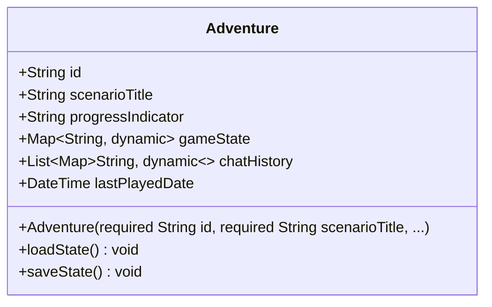

# Adventure Technical Document  
**Data:** 22/04/2025  

## Visão Geral  
A classe `Adventure` representa uma aventura/jornada no sistema IA Master, armazenando informações sobre o progresso do usuário, estado do jogo e histórico de conversas.  

## Diagrama UML da Classe  


## Métodos  

### Construtor  
```dart
Adventure({
  required this.id,
  required this.scenarioTitle, 
  required this.progressIndicator,
  required this.gameState,
  required this.chatHistory,
  required this.lastPlayedDate
})
```
**Descrição:**  
Cria uma nova instância de Adventure com todos os atributos obrigatórios.

### loadState()  
```dart
void loadState()
```
**Descrição:**  
(Pendente de implementação) Carregará o estado do jogo do repositório.  
**Notas:**  
- Será implementado quando AdventureRepository estiver pronto
- Lançará UnimplementedError até então

### saveState()  
```dart
void saveState()
```
**Descrição:**  
(Pendente de implementação) Salvará o estado do jogo no repositório.  
**Notas:**  
- Será implementado quando AdventureRepository estiver pronto
- Lançará UnimplementedError até então

## Detalhes de Implementação  
**Status atual:**  
- A implementação atual (v1.0) difere do plano, contendo:
  - `title` em vez de `scenarioTitle`
  - `description` (não planejado)
  - `scenarioIds` em vez de `gameState`
  - `createdAt` em vez de `lastPlayedDate`
  - Métodos `fromJson`/`toJson` em vez de `loadState`/`saveState`

**Bibliotecas utilizadas:**  
- `dart:core` para tipos básicos
- Futuramente: `package:freezed` para modelos imutáveis

## Histórico de Alterações  
| Data       | Autor       | Descrição                          |
|------------|-------------|------------------------------------|
| 22/04/2025 | Roo (AI)    | Criação do documento técnico       |
| 22/04/2025 | Roo (AI)    | Nota sobre diferenças implementação|

## Implementation History
[ID: ADV-001] 22/04/2025 18:18 - Revisão de implementação
Reason: Atualização para refletir o estado atual da classe Adventure
Changes:
 - Verificação de alinhamento entre código e documentação
 - Confirmação dos atributos implementados
Future Modification Guidelines:
 - Atualizar quando novos métodos forem implementados
 - Revisar após integração com AdventureRepository