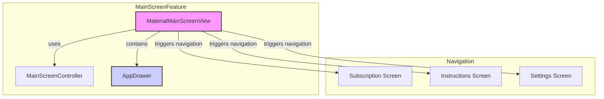
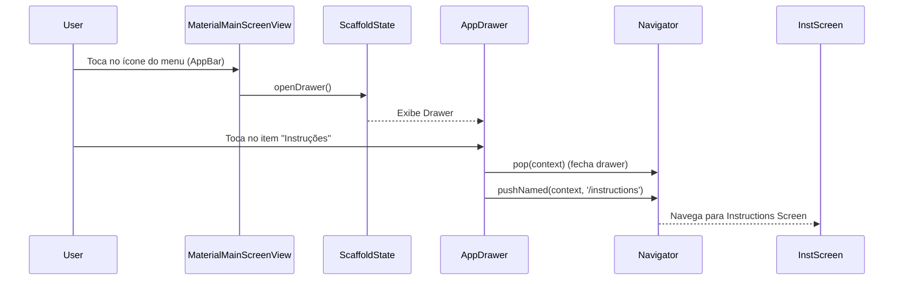

# Plano de Implementação: Ajustes na AppBar da Main Screen (Material)

Este documento detalha o plano para modificar a AppBar da tela principal (`MaterialMainScreenView`) do aplicativo IA Master, conforme solicitado.

## a. Metas e Escopo

*   **Meta Principal:** Substituir o título estático "IA Master" na `AppBar` por um menu hamburger funcional que dá acesso a outras seções do aplicativo.
*   **Escopo:**
    *   Remover o widget `Text` atual do título da `AppBar`.
    *   Adicionar um `IconButton` com o ícone `Icons.menu` (hamburger).
    *   Implementar um `Drawer` (menu lateral) que será aberto ao tocar no ícone do menu.
    *   Adicionar os itens "Assinatura", "Instruções" e "Configurações" ao `Drawer`.
    *   Implementar a navegação para as respectivas telas a partir dos itens do `Drawer`.
    *   Tornar a `AppBar` transparente (`backgroundColor: Colors.transparent`, `elevation: 0`).
    *   Fazer a `AppBar` ocultar automaticamente ao rolar a lista principal para baixo e reaparecer ao rolar para cima.
*   **Fora do Escopo:**
    *   Criação das telas de "Assinatura", "Instruções" e "Configurações" (assume-se que existem ou serão criadas separadamente).
    *   Definição detalhada do estilo visual do `Drawer` (além do básico para funcionalidade).
    *   Implementação da lógica de busca e filtro (RF-009.1, RF-009.2) mencionada nos TODOs do código.

## b. Entradas e Artefatos

*   **Código Fonte:**
    *   `ai_master/lib/features/main_screen/view/material_main_screen_view.dart` (Arquivo a ser modificado)
    *   `ai_master/lib/controllers/main_screen_controller.dart` (Para referência de contexto)
*   **Documentos de Referência:**
    *   `docs/requirements_analysis/ia-master-main-screen-srs.md` (Requisitos Funcionais RF-010, RF-011 e Não Funcionais RNF-001)
*   **Decisões do Usuário (01/05/2025):**
    *   Itens do menu: Assinatura, Instruções, Configurações.
    *   AppBar transparente.
    *   AppBar oculta/mostra com scroll.
    *   (Implícito) Usar `Drawer` para o menu.
    *   (Implícito) Usar ícone `Icons.menu`.

## c. Metodologia

1.  **Preparação:**
    *   Criar um `GlobalKey<ScaffoldState>` no `_MaterialMainScreenViewState` para controlar o `Scaffold` e abrir o `Drawer`.
2.  **Modificar `Scaffold`:**
    *   Associar a `GlobalKey` criada ao `Scaffold`.
    *   Adicionar a propriedade `drawer` ao `Scaffold`, instanciando um novo widget `AppDrawer` (a ser criado).
3.  **Modificar `AppBar` para `SliverAppBar`:**
    *   Substituir o `AppBar` atual dentro do `Scaffold` por um `NestedScrollView`.
    *   O `headerSliverBuilder` do `NestedScrollView` conterá um `SliverAppBar`.
    *   Configurar o `SliverAppBar`:
        *   Remover a propriedade `title`.
        *   Adicionar um `IconButton` na propriedade `leading` (ou `actions` se preferir o ícone à direita) que, ao ser pressionado (`onPressed`), chamará `_scaffoldKey.currentState?.openDrawer()`.
        *   Definir `backgroundColor: Colors.transparent`.
        *   Definir `elevation: 0`.
        *   Definir `pinned: true` (para manter o ícone visível mesmo quando recolhida).
        *   Definir `floating: true` (para reaparecer ao rolar para cima).
        *   Definir `snap: true` (opcional, para animação mais rápida ao reaparecer).
4.  **Adaptar Corpo do `Scaffold`:**
    *   Mover o `Consumer<MainScreenController>` e o `RefreshIndicator` com o `ListView` para dentro da propriedade `body` do `NestedScrollView`.
    *   Garantir que o `RefreshIndicator` continue funcionando corretamente dentro do `NestedScrollView`.
5.  **Criar `AppDrawer` Widget:**
    *   Criar um novo arquivo (ex: `ai_master/lib/widgets/app_drawer.dart`).
    *   Implementar um `StatelessWidget` chamado `AppDrawer`.
    *   Usar um `Drawer` como widget raiz.
    *   Adicionar um `ListView` dentro do `Drawer`.
    *   Incluir `ListTile`s para "Assinatura", "Instruções" e "Configurações".
    *   Configurar o `onTap` de cada `ListTile` para:
        *   Fechar o drawer: `Navigator.pop(context);`
        *   Navegar para a tela correspondente (ex: `Navigator.pushNamed(context, '/subscription');`). As rotas exatas precisam ser confirmadas.
6.  **Testes:**
    *   Verificar se o ícone do menu aparece corretamente.
    *   Verificar se o `Drawer` abre e fecha ao tocar no ícone e nos itens.
    *   Verificar se a `AppBar` está transparente.
    *   Verificar se a `AppBar` oculta ao rolar para baixo e reaparece ao rolar para cima.
    *   Verificar se o `RefreshIndicator` ainda funciona.
    *   Verificar se a navegação a partir dos itens do `Drawer` funciona (assumindo que as rotas/telas existem).

## d. Entregáveis

*   **Plano de Implementação (este documento):** `docs/class_implementation/main-screen/ajustes-interface/main_screen_appbar_plan.md`
*   **Código Modificado:** `ai_master/lib/features/main_screen/view/material_main_screen_view.dart`
*   **Novo Widget:** `ai_master/lib/widgets/app_drawer.dart` (ou similar)
*   **Diretório:** `docs/class_implementation/main-screen/ajustes-interface/` (será criado se não existir para salvar este plano).

## e. Visualização (Mermaid)

**Diagrama de Componentes (Simplificado):**

**Diagrama de Sequência (Abertura do Drawer e Navegação):**

## f. Riscos e Mitigação

| Risco                                                                 | Probabilidade | Impacto | Mitigação                                                                                                                               |
| :-------------------------------------------------------------------- | :------------ | :------ | :-------------------------------------------------------------------------------------------------------------------------------------- |
| Telas de destino (Assinatura, Instruções, Configurações) não existem. | Média         | Médio   | Verificar existência das rotas/telas antes da implementação. Criar telas/rotas placeholder se necessário. Comunicar dependência.        |
| Conflito entre `NestedScrollView`, `SliverAppBar` e `RefreshIndicator`. | Média         | Alto    | Testar exaustivamente a interação do scroll e refresh. Consultar documentação/exemplos de `NestedScrollView` com `RefreshIndicator`. |
| Estilo do `Drawer` não combina com o tema da aplicação (RNF-001).     | Baixa         | Baixo   | Aplicar estilos básicos no `AppDrawer`. Criar tarefa separada para estilização avançada se necessário.                                |
| Rotas de navegação (`/subscription`, etc.) não definidas.             | Média         | Médio   | Confirmar nomes das rotas no sistema de navegação do app. Usar placeholders ou serviço de navegação mock se necessário.                 |

## g. Histórico de Mudanças

| Date         | Author      | Description of Changes                |
| :----------- | :---------- | :------------------------------------ |
| 2025-05-01   | Roo (AI)    | Criação inicial do plano.             |

## h. Histórico de Implementação

| 2025-05-01   | Roo (AI)    | Implementado AppDrawer, SliverAppBar transparente com ocultação/exibição no scroll em `MaterialMainScreenView`. |
| 2025-05-01   | Roo (AI)    | Adicionado SystemUiOverlayStyle para garantir transparência total da AppBar (incluindo barra de status). |
| 2025-05-01   | Roo (AI)    | Alterado `pinned` para `false` na SliverAppBar para ocultar completamente a barra (incluindo o menu) durante o scroll. |