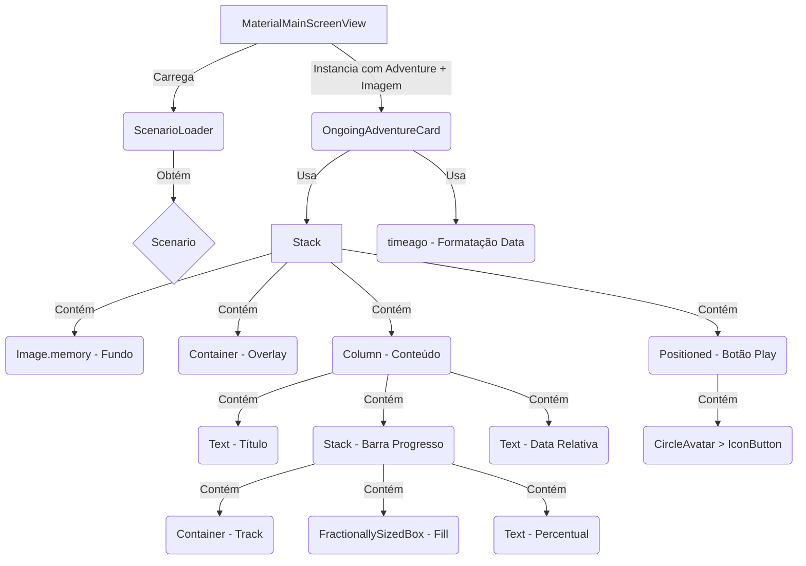

# Plano de Implementação: Refatoração do OngoingAdventureCard e Modelo Adventure

**Data:** 2025-05-03
**Autor:** Roo

**1. Objetivos & Escopo**

*   **Objetivo Principal:**
    *   Modificar o modelo `Adventure` para usar um campo `progress_indicator` do tipo `double?` (representando 0.0 a 1.0) em vez de `String?`.
    *   Refatorar o widget `OngoingAdventureCard` para exibir informações de aventuras em andamento com um novo layout visual, incluindo imagem de fundo, título, **barra de progresso visual com texto percentual**, data de último acesso relativa e um botão de play.
*   **Escopo:**
    *   Modificar `ai_master/lib/models/adventure.dart` (alterar tipo de `progress_indicator`, adicionar comentário).
    *   Executar `flutter pub run build_runner build --delete-conflicting-outputs` para regenerar arquivos `*.freezed.dart` e `*.g.dart`.
    *   Modificar `ai_master/lib/features/main_screen/widgets/ongoing_adventure_card.dart`.
    *   Obter a imagem base64 do `Scenario` correspondente à `Adventure`.
    *   Utilizar o campo `adventure.scenario_title` para o título.
    *   Utilizar o campo `adventure.progress_indicator` (`double?`) para exibir a barra de progresso e o texto (ex: "90% concluído").
    *   Formatar `adventure.last_played_date` para exibição relativa (ex: "há 3 dias").
    *   Adicionar um botão de play funcional (`onTap` existente).
    *   Atualizar o local onde `OngoingAdventureCard` é instanciado para fornecer os dados necessários (incluindo o `Scenario` ou sua imagem).
    *   Atualizar a lógica de persistência/recuperação de `Adventure` (ex: `AdventureRepository`, `DatabaseHelper`) para lidar com o tipo `double?` para `progress_indicator`.
    *   Adicionar a dependência `timeago` para formatação de data relativa.

**2. Entradas & Artefatos**

*   **Arquivos Fonte a Modificar:**
    *   `ai_master/lib/models/adventure.dart`
    *   `ai_master/lib/models/adventure.freezed.dart` (será regenerado)
    *   `ai_master/lib/models/adventure.g.dart` (será regenerado)
    *   `ai_master/lib/features/main_screen/widgets/ongoing_adventure_card.dart`
    *   `ai_master/lib/features/main_screen/view/material_main_screen_view.dart` (provável local de instanciação)
    *   `ai_master/lib/repositories/adventure_repository.dart` (provável local de interação com DB)
    *   `ai_master/lib/services/database_helper.dart` (definição do schema/migração se necessário)
    *   `ai_master/pubspec.yaml` (para adicionar dependência)
*   **Modelos de Dados:**
    *   `ai_master/lib/models/adventure.dart` (será modificado)
    *   `ai_master/lib/models/scenario.dart` (necessário para obter a imagem)
*   **Serviços:**
    *   `ai_master/lib/services/scenario_loader.dart` (potencialmente necessário para carregar cenários na view)

**3. Metodologia**

1.  **Adicionar Dependência:**
    *   Adicionar `timeago: ^latest` às dependências em `pubspec.yaml`.
    *   Executar `flutter pub get`.
2.  **Modificar Modelo `Adventure`:**
    *   Abrir `ai_master/lib/models/adventure.dart`.
    *   Alterar `String? progress_indicator,` para `double? progress_indicator,`.
    *   Adicionar o comentário acima da linha: `/// o progresso atual na aventura, um valor numerico entre 0.0 e 1.0 representando a porcentagem de progresso ( quantidade de cenas concluidas em relaçao ao total de cenas da aventura)`
    *   Salvar o arquivo.
3.  **Regenerar Código:**
    *   Executar o comando: `flutter pub run build_runner build --delete-conflicting-outputs` no terminal.
4.  **Atualizar Persistência:**
    *   Verificar `AdventureRepository` e `DatabaseHelper`. Se `progress_indicator` estava sendo salvo como TEXT no banco, pode ser necessário ajustar o schema (usar REAL ou NUMERIC) ou garantir que a conversão entre `double` e o tipo do banco esteja correta nos métodos `toMap` e `fromMap` (geralmente `json_serializable` cuida disso se o tipo do banco for compatível). *Nota: Se o schema precisar mudar, uma migração de banco pode ser necessária para usuários existentes.*
5.  **Carregar Dados do Cenário:**
    *   Na view (`MaterialMainScreenView`), garantir que os objetos `Scenario` correspondentes a cada `Adventure` em andamento sejam carregados.
6.  **Atualizar Assinatura do Widget:**
    *   Modificar o construtor de `OngoingAdventureCard` para aceitar a `Adventure` (agora com `progress_indicator` double?) e a `String` da imagem base64 (`scenarioImageBase64`).
    *   Atualizar a instanciação do `OngoingAdventureCard` na view.
7.  **Refatorar `OngoingAdventureCard.build`:**
    *   Estrutura base: `SizedBox` > `Card` > `AspectRatio` > `Stack`.
    *   **Imagem de Fundo:** `Image.memory(base64Decode(scenarioImageBase64))`, `fit: BoxFit.cover`.
    *   **Overlay:** `Container` com `color: Colors.black26`.
    *   **Conteúdo:** `Padding` e `Column`.
        *   **Título:** `adventure.scenario_title`.
        *   **Barra de Progresso:** Usar um `Stack` similar ao `VideoCard`:
            *   Container de fundo (track) cinza claro/transparente.
            *   `FractionallySizedBox` com `widthFactor: adventure.progress_indicator ?? 0.0` para a parte preenchida (usar cor primária do tema).
            *   `Text` centralizado sobre a barra: `'${((adventure.progress_indicator ?? 0.0) * 100).toInt()}% concluído'`.
        *   **Data Relativa:** `timeago.format(DateTime.fromMillisecondsSinceEpoch(adventure.last_played_date), locale: 'pt_BR')`.
        *   **Layout:** Alinhar à esquerda, usar `Spacer` ou `MainAxisAlignment`.
    *   **Botão Play:** `Positioned` > `CircleAvatar` > `IconButton`.
    *   **Estilização:** Ajustar fontes, cores, tamanhos.
    *   **Tamanho do Card:** Definir largura e `aspectRatio`.
8.  **Testar:** Verificar modificação do modelo, persistência, carregamento e exibição visual/funcional do card.

**4. Entregáveis**

*   Código atualizado nos arquivos listados em "Arquivos Fonte a Modificar".
*   Modelo `Adventure` atualizado.
*   Widget `OngoingAdventureCard` refatorado e funcional com barra de progresso.
*   Dependência `timeago` adicionada.

**5. Visualização (Conceitual)**

**6. Riscos e Mitigação**

*   **Risco:** Performance ao carregar imagens base64 na tela principal.
    *   **Mitigação:** Garantir que o carregamento seja eficiente. Considerar otimizações se necessário (ex: carregar apenas cenários visíveis, caching).
*   **Risco:** Falha ao decodificar a imagem base64.
    *   **Mitigação:** Adicionar tratamento de erro (`try-catch`) ao redor de `base64Decode` e exibir um placeholder ou ícone de erro caso a decodificação falhe.
*   **Risco:** Dependência `timeago` não suportar localização 'pt_BR' adequadamente (improvável, mas possível).
    *   **Mitigação:** Verificar a documentação do `timeago` ou implementar lógica de formatação relativa customizada.
*   **Risco:** Necessidade de migração do banco de dados se o tipo da coluna `progress_indicator` mudar de TEXT para REAL/NUMERIC.
    *   **Mitigação:** Implementar a migração no `DatabaseHelper` usando `onUpgrade` do SQFlite. Informar o usuário sobre a potencial necessidade de limpar dados do app durante o desenvolvimento se a migração não for implementada inicialmente.
*   **Risco:** Lógica de cálculo/atualização do `progress_indicator` (double) precisa ser implementada em outras partes do código (onde a aventura progride).
    *   **Mitigação:** Identificar onde o progresso é atualizado e implementar a lógica de cálculo (cenas concluídas / total de cenas). Este plano foca apenas na exibição.

**7. Histórico de Mudanças**

| Data       | Autor | Descrição das Mudanças                                      |
| :--------- | :---- | :---------------------------------------------------------- |
| 2025-05-03 | Roo   | Criação inicial do plano de refatoração.                    |
| 2025-05-03 | Roo   | Atualização para usar `progress_indicator` como `double?`. |

**8. Histórico de Implementação**

*(A ser preenchido após a implementação)*