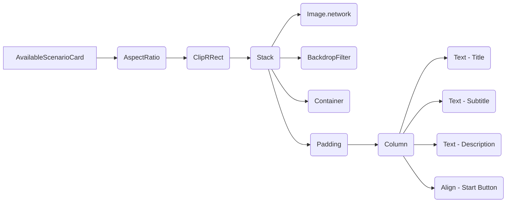

# Plano de Implementação para o Widget AvailableScenarioCard

**a. Goals & Scope:**

*   **Goal:** Aprimorar o widget `AvailableScenarioCard` para replicar o layout desejado (imagem de fundo com blur e overlay, título, subtítulo, descrição e botão "Start") e torná-lo responsivo.
*   **Scope:** Modificar o widget `AvailableScenarioCard` para implementar o novo layout e responsividade. Não serão feitas alterações em outros arquivos ou widgets.

**b. Inputs & Artifacts:**

*   **Source file:** `ai_master/lib/features/main_screen/widgets/available_scenario_card.dart`
*   **Reference:** Descrição do layout desejado fornecida pelo usuário.

**c. Methodology:**

1.  Substituir o widget `Card` existente por um `AspectRatio` e `ClipRRect`.
2.  Adicionar uma imagem de fundo com `Image.network`.
3.  Implementar o blur e o overlay com `BackdropFilter` e `Container`.
4.  Adicionar o título, subtítulo e descrição com widgets `Text`.
5.  Posicionar o botão "Start" no canto inferior direito com `Align`.
6.  Implementar a responsividade com `LayoutBuilder` e `GridView.builder`.

**d. Deliverables:**

*   **Modified file:** `ai_master/lib/features/main_screen/widgets/available_scenario_card.dart`
*   **File name:** `available_scenario_card_v2_{YYYY-MM-DD HH:MM}.dart` (ex: available\_scenario\_card\_v2\_2025-05-05 18:15.dart)
*   **Target directory:** `lib/features/main_screen/widgets/`

**e. Visualization:**

*   **Component Diagram:**

**f. Risks and Mitigation:**

*   **Risk:** Dificuldade em implementar o blur e o overlay corretamente.
    *   **Mitigation:** Consultar a documentação do Flutter e exemplos de código para o widget `BackdropFilter`.
*   **Risk:** Problemas de responsividade em diferentes tamanhos de tela.
    *   **Mitigation:** Testar o widget em diferentes dispositivos e emuladores.

**g. Change History:**

| Date       | Author | Description of changes |
|------------|--------|--------------------------|
| YYYY-MM-DD | Roo    | Initial plan             |

**h. Implementation History:**

(Empty for now)
| Date       | Author | Description of changes                                                                 |
|------------|--------|----------------------------------------------------------------------------------------|
| 2025-05-05 | Roo    | Implemented the new card layout with background image, blur, overlay, and text styling. |
| 2025-05-05 | Roo    | Corrected widget to use `scenario.ambiance` for description instead of non-existent `scenario.description`. |