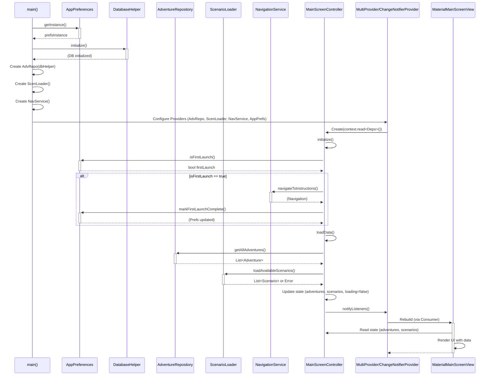

# Plano de Implementação: Integração Main Screen (Controller & View)

**a. Goals & Scope**

**Goals:**

*   Substituir o `DummyMainScreenController` pelo `MainScreenController` real na inicialização da aplicação (`main.dart`).
*   Configurar a injeção das dependências reais (`AdventureRepository`, `ScenarioLoader`, `NavigationService`, `AppPreferences`) para o `MainScreenController`.
*   Garantir que a `MaterialMainScreenView` receba e reaja corretamente ao estado do `MainScreenController` real via `provider`.
*   Verificar que as ações do usuário na `MaterialMainScreenView` (cliques em botões, refresh) acionem corretamente os métodos no `MainScreenController` real.
*   Assegurar que o fluxo de dados (carregamento de aventuras/cenários, estados de erro/vazio) entre o Controller real e a View funcione conforme os requisitos (SRS).
*   Validar a lógica de inicialização, incluindo a verificação de primeiro lançamento (RF-012/RF-013).

**Scope:**

*   **In Scope:**
    *   Modificação do `main.dart` para instanciar e fornecer o `MainScreenController` real e suas dependências.
    *   Configuração da injeção de dependências (proposta: usar múltiplos `Providers` ou `MultiProvider`).
    *   Chamada do método `initialize()` do `MainScreenController` real.
    *   Testes de integração focados na comunicação Controller-View: carregamento de dados, atualização da UI, tratamento de erros, execução de ações do usuário.
    *   Verificação do fluxo de navegação iniciado pelo Controller (chamadas ao `NavigationService`).
*   **Out of Scope:**
    *   Implementação interna detalhada das dependências (`AdventureRepository`, `ScenarioLoader`, `DatabaseHelper`, `AppPreferences`, `NavigationService`). Assume-se que existem e funcionam conforme seus contratos.
    *   Implementação das telas de destino da navegação (Chat, Instruções, Assinatura).
    *   Implementação completa das funcionalidades marcadas como TODO na `MaterialMainScreenView` (rotação automática, lógica de busca/filtro na UI, menu AppBar).
    *   Refatoração profunda do gerenciamento de estado (manter o uso de `provider` existente).
    *   Testes unitários detalhados para o `MainScreenController` ou suas dependências.

**b. Inputs & Artifacts**

*   **Documentos de Referência:**
    *   `docs/requirements_analysis/ia-master-main-screen-srs.md`
    *   `docs/uml_diagram/main-screen/ia-master-main-screen-class-diagram.md`
    *   `docs/class_implementation/main-screen/main_screen_controller_documento_tecnico.md`
    *   `docs/class_implementation/main-screen/material_main_screen_view_plano_implementacao.md`
*   **Código Fonte Relevante:**
    *   `ai_master/lib/main.dart` (a ser modificado)
    *   `ai_master/lib/controllers/main_screen_controller.dart` (a ser instanciado)
    *   `ai_master/lib/features/main_screen/view/material_main_screen_view.dart` (consumidor)
    *   Arquivos das dependências (ex: `adventure_repository.dart`, `scenario_loader.dart`, `navigation_service.dart`, `app_preferences.dart`, `database_helper.dart`)

**c. Methodology**

1.  **Preparação das Dependências:**
    *   Identificar/Confirmar os construtores das classes: `AdventureRepository`, `ScenarioLoader`, `NavigationService`, `AppPreferences`.
    *   Verificar se alguma dependência requer inicialização assíncrona (ex: `DatabaseHelper.initialize()`, `AppPreferences.getInstance()`).
2.  **Configuração da Injeção de Dependência em `main.dart`:**
    *   Modificar a função `main()` para ser `async` se necessário (devido à inicialização de dependências).
    *   Garantir `WidgetsFlutterBinding.ensureInitialized();`.
    *   Instanciar as dependências:
        *   Se houver inicialização `async`, usar `await` antes de `runApp`.
        *   Exemplo: `final prefs = await AppPreferences.getInstance();`, `final dbHelper = DatabaseHelper(); await dbHelper.initialize();`
        *   Instanciar `AdventureRepository(dbHelper)`, `ScenarioLoader()`, `NavigationService()`, `AppPreferences()`.
    *   Remover a criação do `DummyMainScreenController`.
    *   Utilizar `MultiProvider` para fornecer tanto as dependências quanto o `MainScreenController` real.
        *   Fornecer instâncias das dependências (ex: `Provider<AdventureRepository>.value(value: adventureRepo)`).
        *   Usar `ChangeNotifierProvider` para o `MainScreenController`, injetando as dependências obtidas do contexto do `Provider`. Exemplo:
          ```dart
          ChangeNotifierProvider<MainScreenController>(
            create: (context) => MainScreenController(
              adventureRepo: context.read<AdventureRepository>(),
              scenarioLoader: context.read<ScenarioLoader>(),
              navigationService: context.read<NavigationService>(),
              appPreferences: context.read<AppPreferences>(),
            )..initialize(), // Chamar initialize aqui
          ),
          ```
3.  **Ajustes na `MaterialMainScreenView` (se necessário):**
    *   Revisar o código da View para garantir que o `Consumer<MainScreenController>` e as chamadas `controller.metodo()` continuam funcionando com o Controller real. Geralmente, nenhuma mudança é necessária aqui se a interface do Controller foi mantida.
4.  **Testes e Verificação:**
    *   Executar o aplicativo (`flutter run`).
    *   **Carregamento Inicial:** Verificar se os indicadores de loading aparecem e desaparecem, e se os dados (aventuras/cenários) são carregados e exibidos corretamente.
    *   **Estado Vazio:** Testar o cenário sem aventuras em andamento e/ou sem cenários disponíveis (pode exigir manipulação de dados no DB/Assets). Verificar se as mensagens corretas (RF-003) são exibidas.
    *   **Estado de Erro:** Simular um erro no `ScenarioLoader` (ex: arquivo JSON inválido ou ausente) e verificar se a mensagem de erro (RF-008) é exibida na seção correspondente.
    *   **Ações do Usuário:**
        *   Clicar no botão "Play" de uma aventura em andamento. Verificar (via logs ou debug) se `MainScreenController.onContinueAdventure` é chamado com o ID correto e se `NavigationService.navigateToChat` (ou método equivalente) é invocado.
        *   Clicar no botão "Start" de um cenário (destaque ou lista). Verificar se `MainScreenController.onStartScenario` é chamado com o `Scenario` correto e se a navegação é iniciada.
        *   Usar o `RefreshIndicator` (pull-to-refresh). Verificar se `MainScreenController.loadData` é chamado e a UI é atualizada.
    *   **Primeiro Lançamento:** Limpar os dados do `AppPreferences` (ou simular o primeiro lançamento) e verificar se a navegação para a tela de Instruções ocorre (RF-012). Em lançamentos subsequentes, verificar se a tela de Instruções é pulada (RF-013).

**d. Deliverables**

*   Código fonte modificado:
    *   `ai_master/lib/main.dart` (com a configuração de Providers e instanciação do Controller real).
*   Este documento de plano de implementação atualizado (se necessário durante o processo).
*   Confirmação (via testes) de que a integração Controller-View está funcional.

**e. Visualization (Mermaid)**

**Diagrama de Sequência: Inicialização e Carregamento**



**f. Risks and Mitigation**

*   **Risk:** Complexidade na configuração da injeção de dependência, especialmente com inicialização assíncrona.
    *   **Mitigation:** Seguir padrões claros para `async` em `main`. Usar `MultiProvider` de forma estruturada. Testar a inicialização isoladamente, se necessário.
*   **Risk:** Dependências reais (`AdventureRepository`, `ScenarioLoader`, etc.) não estão totalmente implementadas ou contêm bugs.
    *   **Mitigation:** Focar nos testes de *integração* Controller-View. Se uma dependência falhar, registrar o erro e prosseguir com a integração assumindo o contrato da dependência, mas marcar a necessidade de correção na dependência específica. Usar dados mockados temporariamente nas dependências, se necessário para desbloquear a integração da UI.
*   **Risk:** `NavigationService` ou `AppPreferences` não implementados ou com interface diferente da esperada pelo Controller.
    *   **Mitigation:** Criar implementações mínimas/mockadas dessas dependências que satisfaçam o contrato esperado pelo `MainScreenController` para permitir a compilação e teste da integração principal.
*   **Risk:** Problemas de performance ao carregar dados reais.
    *   **Mitigation:** Monitorar o tempo de carregamento durante os testes. Se for excessivo, otimizar as queries no `AdventureRepository` ou a lógica no `ScenarioLoader` (tarefa separada), mas garantir que a UI exiba corretamente o estado de loading (RNF-002).
*   **Risk:** A lógica de `initialize()` ou `loadData()` no Controller real tem efeitos colaterais inesperados.
    *   **Mitigation:** Depurar o fluxo de execução passo a passo durante os testes de integração. Revisar o código do `MainScreenController` (se disponível) para entender sua lógica interna.

**g. Change History**

| Date       | Author   | Description of changes              |
| :--------- | :------- | :---------------------------------- |
| 2025-04-30 | Roo (AI) | Criação inicial do plano de integração. |

**h. Implementation History**

| Date       | Author   | Description of changes                                                                                                                                                                                             |
| :--------- | :------- | :----------------------------------------------------------------------------------------------------------------------------------------------------------------------------------------------------------------- |
| 2025-04-30 | Roo (AI) | - Modificado `main.dart` para usar `MainScreenController` real e `MultiProvider`. <br>- Adicionada dependência `shared_preferences`. <br>- Criada `SharedPreferencesAppPreferences`. <br>- Criada `MockNavigationService`. <br>- Refatoradas `MainScreenViewAbstract`, `MaterialMainScreenView`, e `PlatformViewFactory` para remover dependência explícita do controller no construtor. |
| 2025-04-30 | Roo (AI) | - Implementado `AppNavigationService` real. <br>- Verificado tratamento de erro RF-008 (já existente). <br>- Criados testes de widget (`widget_test.dart`) para estados vazios da `MaterialMainScreenView`. |