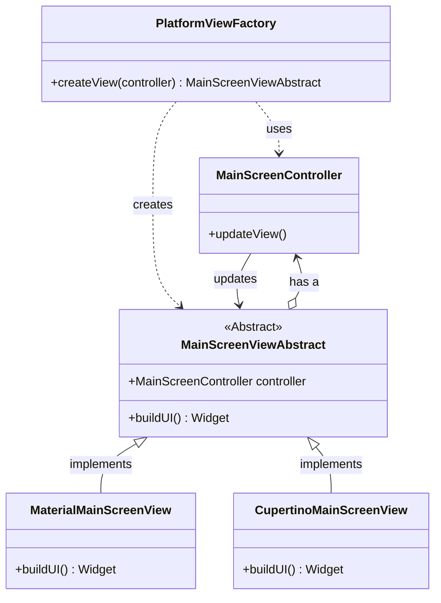

# MainScreenViewAbstract Technical Document - 26/04/2025

## Plano de Implementação: Classe Abstrata `MainScreenViewAbstract`

**a. Objetivos & Escopo:**

*   Criar o arquivo Dart para a classe abstrata `MainScreenViewAbstract`.
*   Definir a classe abstrata `MainScreenViewAbstract` em Flutter/Dart.
*   Incluir a referência necessária ao `MainScreenController`.
*   Definir o método abstrato `buildUI()` que as implementações concretas (Material/Cupertino) deverão sobrescrever para construir a interface do usuário.
*   Garantir que a classe sirva como o contrato de interface para as Views da Tela Principal, conforme definido nos diagramas UML e no SRS.

**b. Inputs & Artefatos:**

*   **Documentos de Referência:**
    *   `docs/uml_diagram/main-screen/ia-master-main-screen-view-abstract.md` (Definição UML da classe)
    *   `docs/uml_diagram/main-screen/ia-master-main-screen-class-diagram.md` (Diagrama de Classes Geral)
    *   `docs/requirements_analysis/ia-master-main-screen-srs.md` (Requisitos Funcionais e Não Funcionais)
*   **Decisões de Clarificação:**
    *   A classe abstrata será mínima, contendo apenas `controller` e `buildUI()`.
    *   As implementações concretas serão responsáveis por criar seus próprios cards.
    *   O caminho do arquivo será `ai_master/lib/features/main_screen/view/main_screen_view_abstract.dart`.

**c. Metodologia:**

1.  **Criação do Arquivo:** Criar um novo arquivo Dart no caminho especificado: `ai_master/lib/features/main_screen/view/main_screen_view_abstract.dart`.
2.  **Importações:** Adicionar as importações necessárias (pelo menos `package:flutter/widgets.dart` para `Widget` e o caminho para `MainScreenController`).
3.  **Definição da Classe:** Declarar a classe abstrata: `abstract class MainScreenViewAbstract`.
4.  **Atributo Controller:** Adicionar o atributo final para o controller: `final MainScreenController controller;`.
5.  **Construtor:** Adicionar um construtor que receba e inicialize o `controller`: `const MainScreenViewAbstract({required this.controller});`.
6.  **Método Abstrato `buildUI`:** Definir o método abstrato `buildUI()` que retorna um `Widget`: `Widget buildUI();`. Este método não terá corpo na classe abstrata.

**d. Entregáveis:**

*   Arquivo Dart contendo a definição da classe abstrata `MainScreenViewAbstract`.
*   **Localização:** `ai_master/lib/features/main_screen/view/main_screen_view_abstract.dart`

**e. Visualização (Contexto Arquitetural):**

**f. Histórico de Alterações:**

| Data       | Autor | Descrição                     |
| :--------- | :---- | :------------------------------ |
| 2025-04-26 | Roo   | Criação inicial do plano.     |

**g. Histórico de Implementação:**

*(Esta seção será preenchida conforme a implementação ocorrer)*