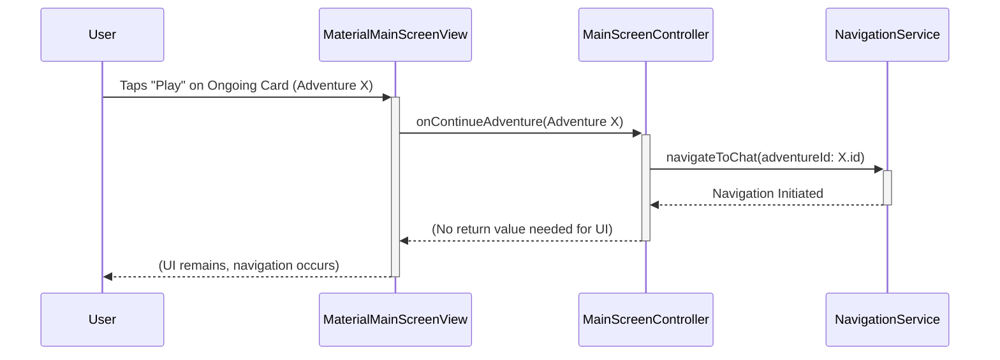
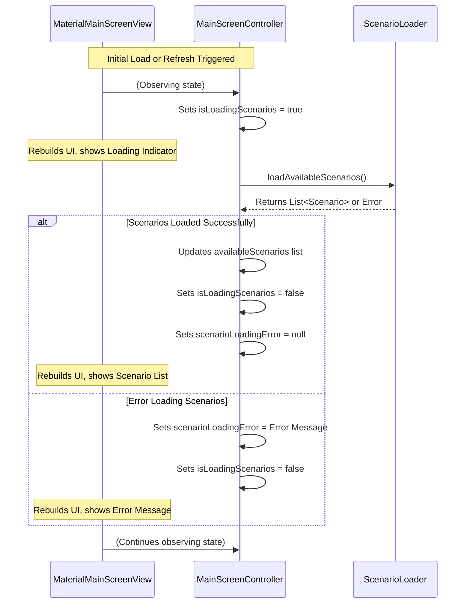

# Plano de Implementação: MaterialMainScreenView

Este documento detalha o plano para implementar a classe `MaterialMainScreenView` no projeto IA Master, responsável por renderizar a tela principal do aplicativo com widgets do Material Design.

## a. Goals & Scope

**Goals:**

*   Implementar a interface visual da tela principal (`MainScreen`) para plataformas Android (e outras que usem Material Design) conforme o wireframe e os requisitos atualizados no SRS (`docs/requirements_analysis/ia-master-main-screen-srs.md`).
*   Exibir as seções: Destaque Rotativo (RF-001), Aventuras em Andamento (RF-001.1, RF-002) e Cenários Disponíveis (RF-005, RF-006).
*   Implementar a funcionalidade de busca (RF-009.1) e filtro (RF-009.2) para cenários disponíveis.
*   Conectar as interações do usuário (cliques nos botões "Play", "Start", itens de menu) aos métodos correspondentes no `MainScreenController`.
*   Gerenciar a exibição de estados de carregamento e mensagens de erro/vazio (RF-003, RF-008).
*   Garantir aderência às diretrizes do Material Design 3 e aos requisitos não funcionais (RNF-001, RNF-004).

**Scope:**

*   **In Scope:**
    *   Criação do arquivo `material_main_screen_view.dart`.
    *   Implementação da classe `MaterialMainScreenView` como um `StatelessWidget` ou `StatefulWidget` (a decidir com base na necessidade de gerenciar estado local da UI, como animações ou controladores de texto/scroll).
    *   Construção da UI usando widgets Material (`Scaffold`, `AppBar`, `PageView` ou `CarouselSlider` para destaque, `ListView`/`GridView` para listas, `Card`, `ElevatedButton`, `IconButton`, `TextField`, `LinearProgressIndicator`, etc.).
    *   Integração com `MainScreenController` para obter dados e delegar ações.
    *   Implementação da lógica de rotação automática para a seção de destaque.
    *   Implementação da lógica básica de busca e filtro na UI (a lógica de filtragem de dados em si reside no Controller/Repository).
    *   Estilização básica conforme o tema escuro/neon (RNF-001).
*   **Out of Scope:**
    *   Implementação detalhada da lógica de negócios no `MainScreenController` (assumido como existente ou a ser implementado separadamente).
    *   Implementação da `PlatformViewFactory` (assumido como existente).
    *   Implementação das telas de destino (Chat, Subscription, Instructions).
    *   Implementação completa da lógica de persistência de dados (AdventureRepository, ScenarioLoader).
    *   Design detalhado e implementação dos critérios de filtro específicos (RF-009.2).
    *   Otimizações de desempenho avançadas (RNF-002) além do uso padrão de widgets eficientes.
    *   Implementação completa de acessibilidade (RNF-003) além do suporte básico dos widgets Material.

## b. Inputs & Artifacts

*   **Documentos de Requisitos:**
    *   `docs/requirements_analysis/ia-master-main-screen-srs.md` (Atualizado)
*   **Documentos de Design UML:**
    *   `docs/uml_diagram/main-screen/ia-master-main-screen-view-abstract.md`
    *   `docs/uml_diagram/main-screen/ia-master-material-main-screen-view.md`
    *   `docs/uml_diagram/main-screen/ia-master-main-screen-controller.md`
*   **Artefatos Visuais:**
    *   Wireframe da Tela Principal (fornecido na tarefa inicial).
*   **Código Fonte Relevante (Estrutura Esperada):**
    *   `ai_master/lib/features/main_screen/view/main_screen_view_abstract.dart` (Interface a ser implementada)
    *   `ai_master/lib/controllers/main_screen_controller.dart` (Dependência a ser injetada)
    *   `ai_master/lib/models/adventure.dart`, `ai_master/lib/models/scenario.dart` (Modelos de dados a serem exibidos)

## c. Methodology

1.  **Criação do Arquivo:** Criar o arquivo `ai_master/lib/features/main_screen/view/material_main_screen_view.dart`.
2.  **Estrutura da Classe:** Definir a classe `MaterialMainScreenView` implementando `MainScreenView` (provavelmente como um `StatelessWidget` que recebe o `MainScreenController`).
3.  **Layout Principal:** Implementar o `buildUI` usando `Scaffold` com `AppBar` (incluindo título e possivelmente o ícone de menu hambúrguer para RF-010/RF-011).
4.  **Seção Destaque:**
    *   Implementar um `PageView` ou `CarouselSlider` para exibir até 3 cards.
    *   Criar um widget `_HighlightCard` reutilizável.
    *   Implementar a lógica de rotação automática (ex: usando `Timer` e `PageController`).
    *   Conectar o botão "Start" ao `controller.onStartScenario(scenario)`.
5.  **Seção Ongoing Adventures:**
    *   Verificar `controller.ongoingAdventures`. Se vazio, exibir mensagem (RF-003).
    *   Se houver dados, usar `ListView.builder` (horizontal) para exibir os cards.
    *   Criar um widget `_OngoingAdventureCard` reutilizável, exibindo título, gênero, `LinearProgressIndicator` (barra visual), "Last access" e botão/ícone "Play".
    *   Conectar o botão "Play" ao `controller.onContinueAdventure(adventure)`.
6.  **Seção Available Scenarios:**
    *   Adicionar `TextField` para busca (RF-009.1) e `IconButton` para filtro (RF-009.2). Conectar `onChanged` do TextField e `onPressed` do filtro aos métodos correspondentes no controller (ex: `controller.onSearchQueryChanged`, `controller.onFilterPressed`).
    *   Verificar `controller.isLoadingScenarios` para exibir `CircularProgressIndicator`.
    *   Verificar `controller.scenarioLoadingError` para exibir mensagem de erro (RF-008).
    *   Se houver cenários (`controller.availableScenarios`), usar `GridView.builder` ou `ListView.builder` para exibir os cards.
    *   Criar um widget `_AvailableScenarioCard` reutilizável, exibindo título, gênero e descrição (aprox. 4 linhas).
    *   Conectar o card (ou um botão "Start" dentro dele) ao `controller.onStartScenario(scenario)`.
7.  **Integração com Controller:** Garantir que a View observe as mudanças no Controller (seja via `ChangeNotifierProvider`, `BlocBuilder`, `StreamBuilder`, etc., dependendo da arquitetura de gerenciamento de estado adotada no projeto) para re-renderizar a UI quando os dados (aventuras, cenários, estado de loading/erro) mudarem.
8.  **Estilização:** Aplicar cores, fontes e espaçamentos consistentes com o Material Design 3 e o tema escuro/neon (RNF-001), utilizando o `ThemeData` do aplicativo.
9.  **Testes Iniciais:** Realizar testes manuais básicos para verificar a renderização correta das seções, a navegação (simulada, se necessário) e a resposta aos estados de carregamento/erro.

## d. Deliverables

*   **Arquivo Fonte:** `ai_master/lib/features/main_screen/view/material_main_screen_view.dart` contendo a implementação completa da classe `MaterialMainScreenView`.
*   **Documento de Implementação (Este Plano):** `docs/class_implementation/main-screen/material_main_screen_view_plano_implementacao.md` (a ser salvo após aprovação).

## e. Visualization (Mermaid)

**Diagrama de Componentes (Visão Geral da UI):**

```mermaid
graph TD
    subgraph MaterialMainScreenView
        direction TB
        Scaffold --> AppBar
        Scaffold --> Body
        Body --> HighlightSection[Highlight Section (PageView/Carousel)]
        Body --> OngoingSection[Ongoing Adventures (ListView Horizontal)]
        Body --> AvailableSection[Available Scenarios (Column)]

        HighlightSection --> HighlightCard1[Card Destaque 1]
        HighlightSection --> HighlightCard2[Card Destaque 2]
        HighlightSection --> HighlightCard3[Card Destaque 3]

        OngoingSection --> OngoingCard1[Card Ongoing 1]
        OngoingSection --> OngoingCard2[Card Ongoing 2]

        AvailableSection --> SearchFilter[Search Bar & Filter Button]
        AvailableSection --> ScenarioList[Scenario List (GridView/ListView)]
        ScenarioList --> AvailableCard1[Card Available 1]
        ScenarioList --> AvailableCard2[Card Available 2]
        ScenarioList --> AvailableCardN[Card Available N]

        AppBar --- MenuButton(Menu Icon - Optional)
        HighlightCard1 --- StartButton1(Start Button)
        OngoingCard1 --- PlayButton1(Play Button/Icon)
        AvailableCard1 --- StartButtonN(Start Button/Tap)
    end

    MaterialMainScreenView -- reads state from --> MainScreenController
    MaterialMainScreenView -- delegates actions to --> MainScreenController

    style MaterialMainScreenView fill:#f9f,stroke:#333,stroke-width:2px
```

**Diagrama de Sequência (Fluxo: Clicar "Play" em Ongoing Adventure):**



**Diagrama de Sequência (Fluxo: Carregar Available Scenarios):**



## f. Risks and Mitigation

*   **Risk:** Complexidade na implementação da rotação automática da seção de destaque (animações, timers).
    *   **Mitigation:** Utilizar bibliotecas estabelecidas como `carousel_slider` ou seguir exemplos robustos de implementação de `PageView` com `Timer`. Começar com uma implementação simples e refinar.
*   **Risk:** Gerenciamento de estado da UI (busca, filtro, loading) pode se tornar complexo.
    *   **Mitigation:** Adotar um padrão de gerenciamento de estado claro (Provider, BLoC, Riverpod, etc.) consistente com o restante do projeto. Manter a lógica de estado principalmente no `MainScreenController`.
*   **Risk:** Inconsistências visuais entre os cards e o design geral.
    *   **Mitigation:** Criar widgets de card reutilizáveis (`_HighlightCard`, `_OngoingAdventureCard`, `_AvailableScenarioCard`) para garantir consistência. Realizar revisões visuais frequentes comparando com o wireframe e o tema.
*   **Risk:** Dificuldade em obter dados do `MainScreenController` ou delegar ações corretamente.
    *   **Mitigation:** Definir claramente a interface de comunicação entre View e Controller. Utilizar injeção de dependência para fornecer o Controller à View.
*   **Risk:** Performance da lista de cenários disponíveis com muitos itens.
    *   **Mitigation:** Utilizar construtores eficientes como `ListView.builder` ou `GridView.builder`. Considerar paginação ou carregamento infinito na lógica do Controller/Repository se o número de cenários for muito grande (embora a implementação na View seja apenas consumir os dados paginados).

## g. Change History

| Date       | Author   | Description of changes                                      |
| :--------- | :------- | :---------------------------------------------------------- |
| 2025-04-30 | Roo (AI) | Initial creation of the implementation plan.                |

## h. Implementation History
| 2025-04-30 | Roo (AI) | Implemented basic structure (`Scaffold`, `AppBar`, `ListView`). Added `Consumer` for reactivity. Implemented `_buildHighlightSection`, `_buildOngoingAdventuresSection`, `_buildAvailableScenariosSection` with placeholders and basic logic for loading/empty/error states. Created `_HighlightCard`, `_OngoingAdventureCard`, `_AvailableScenarioCard` widgets. Added `provider` dependency. Added DartDoc comments. |
| 2025-04-30 | Roo (AI) | Modified `main.dart` temporarily with `DummyMainScreenController` to preview the UI. Executed `flutter run`. |