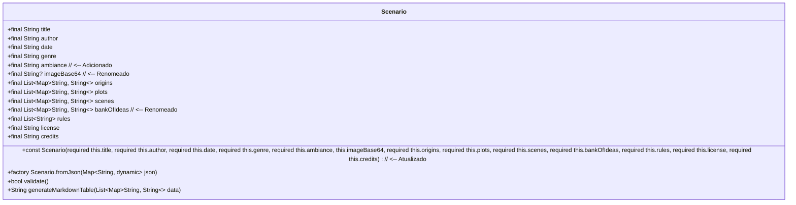

# Scenario Technical Document

**Date:** 2025-04-24

## Overview

A classe `Scenario` é um modelo de dados projetado para encapsular todas as informações pertinentes a um cenário de aventura ou RPG. Ela serve como uma estrutura centralizada para armazenar metadados (como título, autor, data e gênero), componentes narrativos (origens, tramas, cenas, banco de ideias), regras específicas do cenário, informações de licenciamento e créditos. O objetivo principal desta classe é fornecer uma representação imutável e validável dos dados de um cenário, facilitando o carregamento, a manipulação e a persistência dessas informações dentro da aplicação AI Master.

## UML Class Diagram

## Attributes

*   **`title`**: `final String` - O título principal do cenário.
*   **`author`**: `final String` - O nome do autor ou criador do cenário.
*   **`date`**: `final String` - A data de criação ou publicação do cenário (formato livre, mas consistente é recomendado).
*   **`genre`**: `final String` - O gênero principal do cenário (ex: Fantasia, Ficção Científica, Terror).
*   **`ambiance`**: `final String` - Uma descrição textual que define o tom, a atmosfera ou a premissa geral do cenário. Usado para dar ao jogador uma ideia do tipo de experiência esperada (RF-006). // <-- Adicionado
*   **`imageBase64`**: `final String?` - Uma representação opcional da imagem de capa ou ilustrativa do cenário, codificada em Base64. Pode ser nulo. // <-- Renomeado
*   **`origins`**: `final List<Map<String, String>>` - Uma lista de mapas descrevendo as possíveis origens ou antecedentes dos personagens dentro do cenário. Cada mapa pode conter chaves como 'races', 'classes'.
*   **`plots`**: `final List<Map<String, String>>` - Uma lista de mapas detalhando os principais pontos da trama ou arcos narrativos do cenário. Cada mapa pode conter chaves como 'when', 'you_need_to', 'otherwise'.
*   **`scenes`**: `final List<Map<String, String>>` - Uma lista de mapas descrevendo cenas específicas, locais ou encontros importantes no cenário. Cada mapa pode conter chaves como 'place', 'character', 'event'.
*   **`bankOfIdeas`**: `final List<Map<String, String>>` - Uma coleção de ideias, ganchos de aventura, NPCs ou outros elementos que podem ser usados para expandir o cenário. Cada mapa pode conter chaves como 'subject', 'action', 'thing', 'quality'. // <-- Renomeado e chaves atualizadas
*   **`rules`**: `final List<String>` - Uma lista de strings contendo regras específicas ou modificações de regras aplicáveis a este cenário.
*   **`license`**: `final String` - Informações sobre a licença sob a qual o cenário é distribuído (ex: CC BY-SA 4.0, OGL).
*   **`credits`**: `final String` - Agradecimentos ou créditos a contribuidores, playtesters, ou fontes de inspiração.

## Methods

### Construtor Padrão

*   **Signature:** `const Scenario({required this.title, required this.author, required this.date, required this.genre, required this.ambiance, this.imageBase64, required this.origins, required this.plots, required this.scenes, required this.bankOfIdeas, required this.rules, required this.license, required this.credits})` // <-- Atualizado
*   **Description:** Cria uma nova instância imutável da classe `Scenario`. Todos os atributos são obrigatórios, exceto `imageBase64`, que é opcional. Garante que um objeto `Scenario` só possa ser criado com todos os dados necessários presentes (exceto a imagem).
*   **Algorithmic Notes:** N/A. Atribuição direta de valores aos atributos `final`.

### Construtor Factory `fromJson`

*   **Signature:** `factory Scenario.fromJson(Map<String, dynamic> json)`
*   **Description:** Cria uma instância de `Scenario` a partir de um mapa (geralmente obtido da decodificação de um JSON). Este construtor é responsável por extrair os valores do mapa (incluindo `ambiance`, `imageBase64`, `bankOfIdeas`), realizar a conversão de tipos necessária (especialmente para as listas de mapas e listas de strings) e validar a presença e o tipo dos campos esperados. Lança exceções apropriadas se os dados de entrada forem inválidos ou estiverem faltando campos obrigatórios. // <-- Atualizado
*   **Algorithmic Notes:**
    1.  Extrai cada valor do mapa `json` usando as chaves correspondentes aos nomes dos atributos.
    2.  Realiza type casting e conversão:
        *   Strings simples são lidas diretamente.
        *   Listas (como `rules`) são convertidas de `List<dynamic>` para `List<String>`.
        *   Listas de Mapas (como `origins`, `plots`, etc.) são convertidas de `List<dynamic>` (onde cada elemento é um `Map<String, dynamic>`) para `List<Map<String, String>>`. Isso pode envolver iteração e casting interno.
    3.  Valida se os campos obrigatórios existem no JSON e se os tipos são compatíveis.
    4.  Retorna uma nova instância `Scenario` usando o construtor padrão com os dados extraídos e convertidos.

### Método `validate`

*   **Signature:** `bool validate()`
*   **Description:** Executa uma verificação de validação na instância atual de `Scenario` para garantir a integridade e a consistência dos dados. O escopo exato da validação pode variar, mas geralmente inclui:
    *   Verificar se strings obrigatórias (como `title`, `author`) não estão vazias.
    *   Verificar se as listas (`origins`, `plots`, etc.) não são nulas (embora possam estar vazias).
    *   Potencialmente, verificar a estrutura interna dos mapas dentro das listas (ex: se mapas em `origins` contêm as chaves esperadas).
*   **Returns:** `true` se a instância for considerada válida, `false` caso contrário.
*   **Algorithmic Notes:** Implementa uma série de verificações condicionais nos atributos da instância. Retorna `false` na primeira falha de validação ou `true` se todas as verificações passarem.

### Método `generateMarkdownTable`

*   **Signature:** `String generateMarkdownTable(List<Map<String, String>> data)`
*   **Description:** Um método utilitário (potencialmente estático ou de instância) que recebe uma lista de mapas (como `origins`, `plots`, `scenes`, ou `bankOfIdeas`) e a formata como uma tabela em sintaxe Markdown. Útil para exibir esses dados de forma estruturada.
*   **Input:** `data` - A lista de mapas a ser convertida.
*   **Returns:** Uma string contendo a tabela formatada em Markdown.
*   **Algorithmic Notes:**
    1.  Verifica se a lista `data` está vazia. Se sim, retorna uma string vazia ou uma mensagem indicando que não há dados.
    2.  Extrai as chaves do primeiro mapa na lista para usar como cabeçalhos da tabela.
    3.  Gera a linha de cabeçalho do Markdown (ex: `| Key1 | Key2 | ... |`).
    4.  Gera a linha separadora do Markdown (ex: `|------|------|-----|`).
    5.  Itera sobre cada mapa na lista `data`.
    6.  Para cada mapa, gera uma linha da tabela Markdown extraindo os valores correspondentes às chaves do cabeçalho (ex: `| Value1 | Value2 | ... |`). Lida com valores ausentes ou nulos apropriadamente (ex: exibindo uma string vazia).
    7.  Concatena todas as linhas geradas (cabeçalho, separador, linhas de dados) em uma única string com quebras de linha.
    8.  Retorna a string completa da tabela Markdown.

## Implementation Details

*   **Linguagem:** Dart
*   **Imutabilidade:** A classe utiliza atributos `final` para garantir que as instâncias de `Scenario`, uma vez criadas, não possam ser modificadas. Isso promove a previsibilidade e a segurança no manuseio dos dados do cenário.
*   **Desserialização:** O construtor factory `Scenario.fromJson` é responsável por converter dados JSON em objetos `Scenario`. Recomenda-se uma implementação robusta que lide com erros de formato, tipos inesperados e campos ausentes no JSON de entrada. O uso de pacotes como `json_annotation` e `build_runner` pode automatizar parte desse processo, mas a lógica central de validação e conversão reside no construtor factory.
*   **Validação:** O método `validate()` fornece um mecanismo para verificar a integridade dos dados após a criação da instância (seja pelo construtor padrão ou pelo `fromJson`).
*   **Formatação:** O método `generateMarkdownTable` oferece uma funcionalidade para apresentar dados complexos (listas de mapas) de forma legível usando Markdown.
*   **Dependências:** A definição básica da classe depende apenas do SDK do Dart. A implementação de `fromJson` pode opcionalmente usar `package:json_annotation` para geração de código.

## Change History

| Date       | Author | Description                      |
| :--------- | :----- | :------------------------------- |
| 2025-04-24 | Roo    | Criação inicial da documentação. |

## Implementation History

*(Esta seção será preenchida conforme a classe for implementada e modificada ao longo do tempo).*

[ID: SCENARIO_UPDATE_202504251553] 25/04/2025 15:53 - Adição do atributo ambiance e renomeação
Reason: Incluir um campo de descrição/atmosfera conforme RF-006 e alinhar nomes com convenção camelCase, baseado na revisão dos diagramas UML e JSON.
Changes:
 - Adicionado atributo `final String ambiance`.
 - Renomeado atributo `imagemBase64` para `imageBase64`.
 - Renomeado atributo `bankOfIdeas` para `bankOfIdeas`.
 - Atualizado construtor padrão para incluir `ambiance`.
 - Atualizada descrição do construtor `fromJson` para mencionar `ambiance` e os nomes atualizados.
 - Atualizada seção de Atributos com `ambiance` e nomes/chaves corretos.
 - Atualizado diagrama UML na documentação.
Future Modification Guidelines:
 - Garantir que o campo `ambiance` seja populado corretamente durante a desserialização JSON.
 - Utilizar `ambiance` na UI para exibir a descrição do cenário.

[ID: SCENARIO_INIT_202504242333] 24/04/2025 23:33 - Criação inicial da classe Scenario
Reason: Estabelecer a estrutura de dados fundamental para representar cenários de aventura.
Changes:
 - Criação do arquivo `ai_master/lib/models/scenario.dart`.
 - Definição da classe `Scenario` com atributos imutáveis (`final`) para título, autor, data, gênero, imagem (opcional), origens, tramas, cenas, banco de ideias, regras, licença e créditos.
 - Implementação do construtor padrão e do construtor factory `fromJson` para desserialização de JSON.
 - Adição de métodos `validate()` para verificação de integridade e `generateMarkdownTable()` para formatação de dados.
Future Modification Guidelines:
 - Manter a imutabilidade da classe.
 - Expandir a validação no método `validate()` conforme necessário.
 - Refinar a lógica de `fromJson` para tratamento de erros mais robusto, se aplicável.
 - Considerar a adição de métodos utilitários conforme a necessidade de manipulação de dados do cenário evoluir.