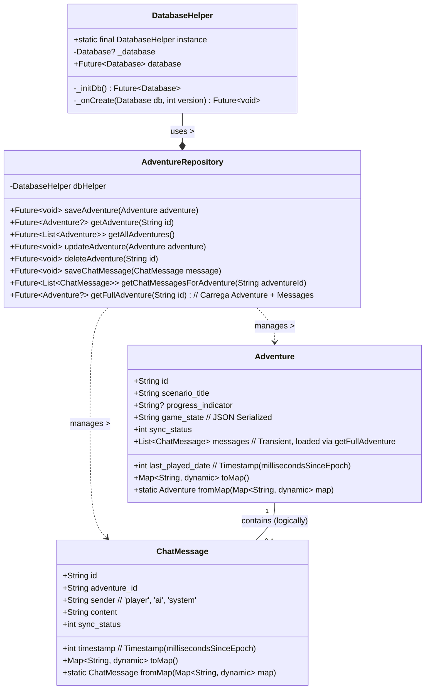

# Documento Técnico: Persistência de Dados com SQFlite

**Data:** 26 de Abril de 2025

## Overview

Este documento detalha a arquitetura e implementação da camada de persistência de dados local para o aplicativo AI Master, utilizando o banco de dados SQFlite. O objetivo principal é permitir que os usuários salvem o progresso de suas aventuras de RPG de texto, incluindo o estado do jogo e o histórico de mensagens do chat, diretamente no dispositivo. Isso garante que os dados persistam entre as sessões do aplicativo, mesmo sem conectividade com a rede.

A implementação segue um padrão de repositório para abstrair as operações de banco de dados da lógica de negócios e da interface do usuário.

## UML Class Diagram

O diagrama abaixo ilustra as principais classes envolvidas na camada de persistência e suas relações:



## Schema SQL

O schema do banco de dados SQFlite define as tabelas `Adventure` e `ChatMessage` para armazenar os dados necessários.

```sql
-- Tabela Adventure
CREATE TABLE Adventure (
    id TEXT PRIMARY KEY NOT NULL,       -- UUID da aventura
    scenario_title TEXT NOT NULL,       -- Título do cenário base
    progress_indicator TEXT,            -- Descrição textual do progresso
    game_state TEXT NOT NULL,           -- Estado do jogo serializado em JSON
    last_played_date INTEGER NOT NULL,  -- Timestamp da última interação (millisecondsSinceEpoch)
    sync_status INTEGER NOT NULL DEFAULT 0 -- Status de sincronização (0=local, 1=syncing, 2=synced, -1=error)
);

-- Índice para ordenação rápida por data
CREATE INDEX idx_adventure_last_played ON Adventure(last_played_date DESC);

-- Tabela ChatMessage
CREATE TABLE ChatMessage (
    id TEXT PRIMARY KEY NOT NULL,           -- UUID da mensagem
    adventure_id TEXT NOT NULL,             -- FK para Adventure.id
    sender TEXT NOT NULL,                   -- 'player', 'ai', 'system'
    content TEXT NOT NULL,                  -- Conteúdo da mensagem
    timestamp INTEGER NOT NULL,             -- Timestamp da mensagem (millisecondsSinceEpoch)
    sync_status INTEGER NOT NULL DEFAULT 0, -- Status de sincronização (0=local)
    FOREIGN KEY (adventure_id) REFERENCES Adventure(id) ON DELETE CASCADE -- Garante integridade referencial
);

-- Índice para busca rápida de mensagens por aventura e ordem cronológica
CREATE INDEX idx_chatmessage_adventure_timestamp ON ChatMessage(adventure_id, timestamp ASC);
```

## Classes Principais

### DatabaseHelper

*   **Arquivo:** `ai_master/lib/services/database_helper.dart`
*   **Descrição:** Uma classe Singleton responsável por gerenciar o ciclo de vida do banco de dados SQFlite. Ela garante que apenas uma instância do banco de dados seja aberta durante a execução do aplicativo.
*   **Responsabilidades:**
    *   Inicializar o banco de dados (`_initDb`): Encontra o caminho apropriado no sistema de arquivos do dispositivo e abre a conexão com o banco de dados (`ai_master_database.db`).
    *   Criar as tabelas (`_onCreate`): Executa as instruções SQL `CREATE TABLE` e `CREATE INDEX` na primeira vez que o banco de dados é criado ou quando a versão é atualizada. A versão inicial do schema é `1`.
    *   Fornecer acesso à instância do banco de dados (`get database`): Retorna a instância `Database` para ser usada pelos repositórios.

### Modelos de Dados

#### Adventure

*   **Arquivo:** `ai_master/lib/models/adventure.dart`
*   **Descrição:** Representa uma sessão de jogo (aventura). Contém metadados sobre a aventura e o estado atual do jogo.
*   **Atributos:** Mapeados diretamente para as colunas da tabela `Adventure`. O `game_state` é armazenado como uma string JSON. A lista `messages` não é persistida diretamente nesta tabela, mas carregada sob demanda pelo `AdventureRepository`.
*   **Métodos:**
    *   `toMap()`: Converte o objeto `Adventure` em um `Map<String, dynamic>` para inserção/atualização no banco de dados.
    *   `fromMap(Map<String, dynamic> map)`: Cria uma instância de `Adventure` a partir de um `Map` recuperado do banco de dados.
    *   *Nota:* A utilização de pacotes como `freezed` e `json_serializable` é recomendada para simplificar a criação desses modelos e a implementação dos métodos `toMap`/`fromMap`, além de garantir imutabilidade.

#### ChatMessage

*   **Arquivo:** `ai_master/lib/models/chat_message.dart` (a ser criado ou atualizado)
*   **Descrição:** Representa uma única mensagem dentro do chat de uma aventura.
*   **Atributos:** Mapeados diretamente para as colunas da tabela `ChatMessage`. `adventure_id` serve como chave estrangeira para a tabela `Adventure`.
*   **Métodos:**
    *   `toMap()`: Converte o objeto `ChatMessage` em um `Map<String, dynamic>`.
    *   `fromMap(Map<String, dynamic> map)`: Cria uma instância de `ChatMessage` a partir de um `Map`.
    *   *Nota:* Assim como `Adventure`, `freezed` e `json_serializable` são recomendados.

### AdventureRepository

*   **Arquivo:** `ai_master/lib/repositories/adventure_repository.dart` (a ser criado ou atualizado)
*   **Descrição:** Implementa o padrão Repository, atuando como uma fachada para o acesso aos dados de `Adventure` e `ChatMessage`. Abstrai a lógica de acesso ao banco de dados (consultas SQL) das outras camadas da aplicação (Controllers, UI).
*   **Responsabilidades:**
    *   Utilizar a instância do `DatabaseHelper` para obter acesso ao banco de dados.
    *   Implementar métodos CRUD (Create, Read, Update, Delete) para `Adventure`:
        *   `saveAdventure(Adventure adventure)`: Insere uma nova aventura.
        *   `updateAdventure(Adventure adventure)`: Atualiza uma aventura existente.
        *   `getAdventure(String id)`: Busca uma aventura pelo ID (sem mensagens).
        *   `getAllAdventures()`: Retorna uma lista de todas as aventuras salvas, ordenadas pela data mais recente (`last_played_date`).
        *   `deleteAdventure(String id)`: Remove uma aventura e suas mensagens associadas (devido ao `ON DELETE CASCADE`).
    *   Implementar métodos para gerenciar `ChatMessage`:
        *   `saveChatMessage(ChatMessage message)`: Insere uma nova mensagem.
        *   `getChatMessagesForAdventure(String adventureId)`: Busca todas as mensagens associadas a uma aventura específica, ordenadas por timestamp.
    *   Implementar métodos combinados:
        *   `getFullAdventure(String id)`: Busca uma aventura pelo ID e carrega sua lista de `ChatMessage` associada.
    *   Gerenciar transações (se necessário) para operações complexas que envolvam múltiplas tabelas.

## Detalhes de Implementação

*   **Dependências:**
    *   `sqflite`: O plugin Flutter para interagir com bancos de dados SQLite. Fornece a API para abrir, criar, consultar e modificar o banco de dados.
    *   `path`: Utilizado em conjunto com `sqflite` para encontrar o caminho correto no sistema de arquivos do dispositivo onde o arquivo do banco de dados será armazenado.
*   **Nome do Banco de Dados:** `ai_master_database.db`
*   **Versão Inicial do Schema:** `1`
*   **Serialização:** Os modelos `Adventure` e `ChatMessage` precisam implementar os métodos `toMap()` e `fromMap()` para converter entre objetos Dart e os mapas usados pelo `sqflite`. O campo `game_state` na `Adventure` será serializado/desserializado de/para JSON antes de ser armazenado/recuperado como `TEXT`.

## Histórico de Alterações

| Data          | Autor | Descrição                                      |
|---------------|-------|------------------------------------------------|
| 26/04/2025    | Roo   | Criação inicial do documento técnico SQFlite. |

## Histórico de Implementação

*(Esta seção será preenchida conforme a implementação avança)*