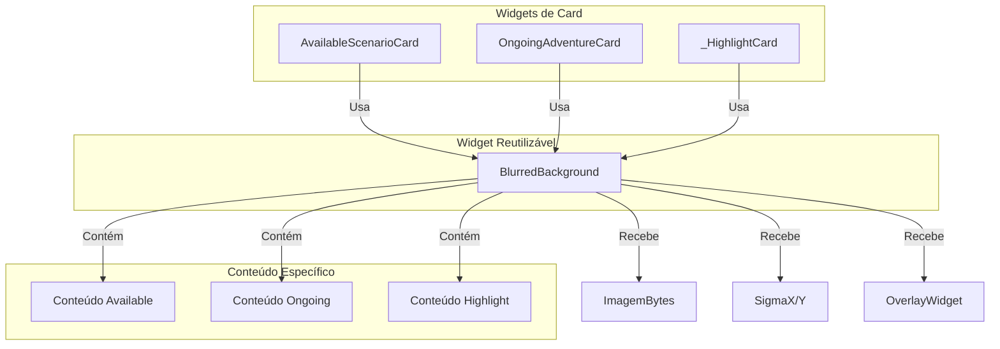

# Plano de Implementação: Refatorar Efeito de Blur para Widget Reutilizável

**a. Goals & Scope:**

*   **Goal:**
    1.  Criar um widget reutilizável (`BlurredBackground`) para encapsular a lógica de exibir uma imagem de fundo com efeito de blur e um overlay personalizável.
    2.  Aplicar este efeito aos widgets `OngoingAdventureCard` e `_HighlightCard` (usado em `HighlightSectionWidget`) usando o novo widget reutilizável.
    3.  Refatorar o widget `AvailableScenarioCard` para também utilizar o `BlurredBackground`.
*   **Scope:**
    *   **Criar:** `ai_master/lib/widgets/blurred_background.dart`
    *   **Modificar:**
        *   `ai_master/lib/features/main_screen/widgets/ongoing_adventure_card.dart`
        *   `ai_master/lib/features/main_screen/widgets/highlight_section_widget.dart` (classe `_HighlightCard`)
        *   `ai_master/lib/features/main_screen/widgets/available_scenario_card.dart`
*   **Intensity:**
    *   `AvailableScenarioCard`: `sigmaX: 5`, `sigmaY: 5` (overlay cor sólida)
    *   `OngoingAdventureCard`: `sigmaX: 3`, `sigmaY: 3` (overlay gradiente)
    *   `_HighlightCard`: `sigmaX: 1`, `sigmaY: 1` (overlay gradiente)

**b. Inputs & Artifacts:**

*   **Source files:**
    *   `ai_master/lib/features/main_screen/widgets/ongoing_adventure_card.dart`
    *   `ai_master/lib/features/main_screen/widgets/highlight_section_widget.dart`
    *   `ai_master/lib/features/main_screen/widgets/available_scenario_card.dart`
*   **Reference:** Solicitação do usuário para replicar o efeito com intensidades específicas e usar um widget reutilizável.

**c. Methodology:**

1.  **Criar `BlurredBackground` Widget (`ai_master/lib/widgets/blurred_background.dart`):**
    *   Criar um `StatelessWidget` chamado `BlurredBackground`.
    *   Definir parâmetros:
        *   `Uint8List? imageBytes`: Bytes da imagem de fundo.
        *   `double sigmaX`: Intensidade do blur X.
        *   `double sigmaY`: Intensidade do blur Y.
        *   `Widget overlayWidget`: O widget a ser usado como overlay (ex: `Container` com cor ou gradiente).
        *   `Widget child`: O conteúdo principal a ser exibido sobre o fundo/blur/overlay.
        *   `BoxFit imageFit`: (Opcional, default `BoxFit.cover`) Como a imagem deve se ajustar.
        *   `Widget placeholder`: (Opcional) Widget a ser exibido se `imageBytes` for nulo.
    *   Implementar a estrutura do `build`: `Stack` > `Image.memory` (ou `placeholder`) > `BackdropFilter` > `overlayWidget` > `child`.
    *   Adicionar DartDocs abrangentes.

2.  **Refatorar `AvailableScenarioCard` (`available_scenario_card.dart`):**
    *   Remover a lógica interna do `Stack` (imagem, `BackdropFilter`, `Container` overlay).
    *   Envolver o conteúdo principal (`Padding` > `Column`) com o novo `BlurredBackground`.
    *   Passar os `imageBytes` decodificados.
    *   Passar `sigmaX: 5`, `sigmaY: 5`.
    *   Passar um `Container(color: Colors.black.withOpacity(0.45))` como `overlayWidget`.
    *   Passar o `Padding` original como `child`.
    *   Atualizar DartDocs.

3.  **Modificar `OngoingAdventureCard` (`ongoing_adventure_card.dart`):**
    *   Remover a lógica interna do `Stack` (imagem, `BackdropFilter` - a ser adicionado -, `Container` overlay gradiente).
    *   Envolver o conteúdo principal (`Padding` > `Column` e `Positioned` botão) com o novo `BlurredBackground`.
    *   Passar os `imageBytes` decodificados de `_buildBackgroundImage`.
    *   Passar `sigmaX: 3`, `sigmaY: 3`.
    *   Passar o `Container` com `LinearGradient` existente (linhas 77-90) como `overlayWidget`.
    *   Passar o `Padding` e o `Positioned` originais (agrupados, talvez em um `Stack` ou `Column` simples) como `child`.
    *   Remover o método `_buildBackgroundImage` se não for mais necessário (a lógica da imagem estará no `BlurredBackground`).
    *   Atualizar DartDocs.

4.  **Modificar `_HighlightCard` (`highlight_section_widget.dart`):**
    *   Remover a lógica interna do `Stack` (imagem, `BackdropFilter` - a ser adicionado -, `Container` overlay gradiente).
    *   Envolver o conteúdo principal (`Positioned` > `Padding` > `Column`) com o novo `BlurredBackground`.
    *   Passar os `imageBytes` decodificados.
    *   Passar `sigmaX: 1`, `sigmaY: 1`.
    *   Passar o `Container` com `LinearGradient` existente (linhas 368-387) como `overlayWidget`.
    *   Passar o `Positioned` original como `child`.
    *   Remover o método `_decodeImage` se não for mais necessário.
    *   Atualizar DartDocs.

**d. Deliverables:**

*   **New file:** `ai_master/lib/widgets/blurred_background.dart`
*   **Modified files:**
    *   `ai_master/lib/features/main_screen/widgets/available_scenario_card.dart`
    *   `ai_master/lib/features/main_screen/widgets/ongoing_adventure_card.dart`
    *   `ai_master/lib/features/main_screen/widgets/highlight_section_widget.dart`
*   **Documentation:** Este arquivo de plano atualizado.

**e. Visualization:**

*   **Relação de Widgets:**

**f. Risks and Mitigation:**

*   **Risk:** Impacto na performance devido ao uso de `BackdropFilter` (centralizado no `BlurredBackground`).
    *   **Mitigation:** Testar performance. O widget reutilizável facilita otimizações futuras em um único local.
*   **Risk:** Design da API do `BlurredBackground` pode não ser flexível o suficiente para todos os casos de uso futuros.
    *   **Mitigation:** Começar com os parâmetros essenciais identificados. Iterar e adicionar mais opções de personalização (ex: `borderRadius`, `placeholder`) conforme necessário.
*   **Risk:** Complexidade na refatoração dos widgets existentes para usar o `BlurredBackground`, especialmente ao passar o `child` corretamente.
    *   **Mitigation:** Realizar a refatoração passo a passo, testando cada widget individualmente após a modificação.

**g. Change History:**

| Date       | Author | Description of changes                                      |
|------------|--------|-------------------------------------------------------------|
| 2025-05-05 | Roo    | Initial plan creation (implementação direta)                |
| 2025-05-05 | Roo    | Modificado para incluir criação de widget reutilizável `BlurredBackground` |

**h. Implementation History:**

(Empty for now)
| Date       | Author | Description of changes                                                                 |
|------------|--------|----------------------------------------------------------------------------------------|
| 2025-05-05 | Roo    | Created reusable `BlurredBackground` widget in `lib/widgets/`.                         |
| 2025-05-05 | Roo    | Refactored `AvailableScenarioCard` to use `BlurredBackground` (sigma 5, color overlay). |
| 2025-05-05 | Roo    | Refactored `OngoingAdventureCard` to use `BlurredBackground` (sigma 3, gradient overlay).|
| 2025-05-05 | Roo    | Refactored `_HighlightCard` (in `highlight_section_widget.dart`) to use `BlurredBackground` (sigma 1, gradient overlay). |