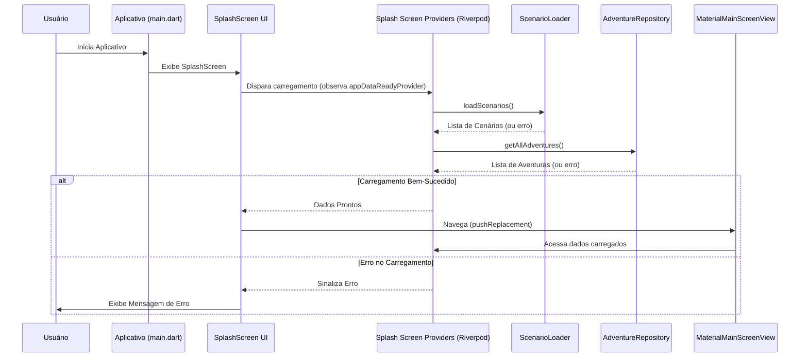
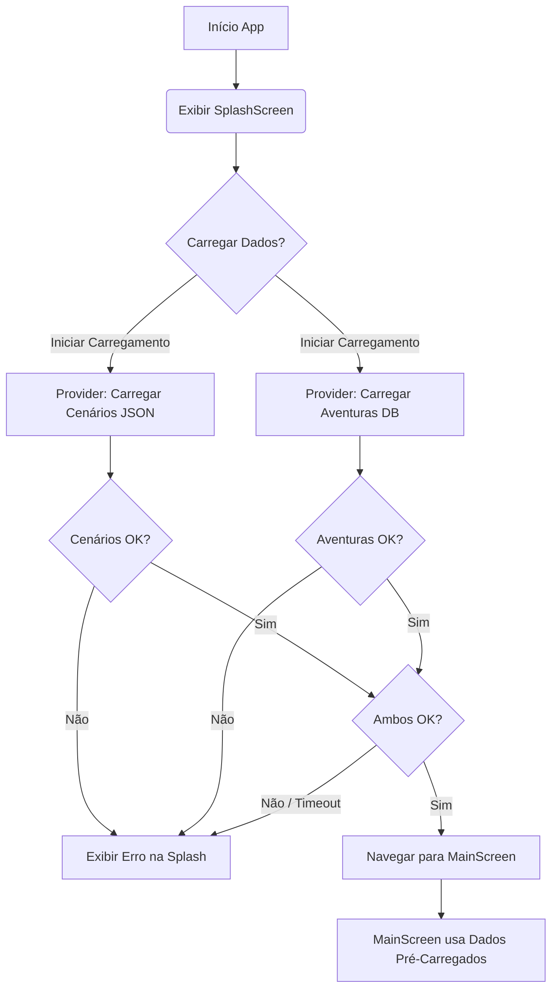

# Plano de Implementação: Splash Screen e Carregamento Centralizado de Dados

**Data de Criação:** 2025-05-06
**Autor:** Roo (IA Architect)
**Status:** Aprovado

## 1. Objetivos e Escopo

*   **Objetivo Principal:** Implementar uma tela de splash que será exibida na inicialização do aplicativo. Esta tela será responsável por carregar todos os dados iniciais necessários (cenários de arquivos JSON e aventuras do banco de dados) antes de exibir a interface principal.
*   **Escopo:**
    *   Criação de um novo widget para a Splash Screen.
    *   Integração da imagem de fundo `splash_screen.jpeg`.
    *   Movimentação da lógica de carregamento de `ScenarioLoader` e `AdventureRepository` para ser disparada pela Splash Screen.
    *   Disponibilização dos dados carregados para o restante do aplicativo (provavelmente via Riverpod, seguindo o padrão existente).
    *   Navegação para a tela principal (`MaterialMainScreenView`) após o carregamento bem-sucedido.
    *   Tratamento básico de erros durante o carregamento.
    *   Atualização do `pubspec.yaml` para incluir a nova imagem.
    *   Refatoração das telas `main_screen` e `all_scenario_screen` para consumir os dados pré-carregados.
*   **Fora do Escopo (nesta fase):**
    *   Animações complexas na splash screen (além de um indicador de progresso).
    *   Mecanismos avançados de retry ou caching de dados além do que já existe.
    *   Sincronização de dados com backend (o foco é o carregamento local inicial).

## 2. Entradas e Artefatos

*   **Arquivos de Código Fonte Relevantes (Entrada):**
    *   `ai_master/lib/services/scenario_loader.dart` (para carregar cenários)
    *   `ai_master/lib/services/database_helper.dart` (para inicialização do DB)
    *   `ai_master/lib/repositories/adventure_repository.dart` (para carregar aventuras)
    *   `ai_master/lib/main.dart` (para definir a tela inicial)
    *   `ai_master/lib/features/main_screen/view/material_main_screen_view.dart` (tela principal)
    *   `ai_master/lib/features/all_scenarios/view/all_scenarios_screen.dart`
    *   `ai_master/lib/providers/main_screen_providers.dart` (para entender o gerenciamento de estado atual)
*   **Assets (Entrada):**
    *   Imagem: `splash_screen.jpeg` (a ser colocada em `ai_master/assets/images/`)
    *   Arquivos JSON de cenários em `ai_master/assets/scenarios/`
*   **Artefatos (Saída):**
    *   Novo diretório e arquivo para a imagem: `ai_master/assets/images/splash_screen.jpeg`
    *   Novos arquivos para a feature Splash Screen:
        *   `ai_master/lib/features/splash_screen/view/splash_screen.dart`
        *   `ai_master/lib/features/splash_screen/providers/splash_providers.dart` (ou similar, para gerenciar o estado de carregamento e os dados)
    *   Modificações nos arquivos existentes (`main.dart`, `pubspec.yaml`, telas que consomem os dados).
    *   Este documento de planejamento.

## 3. Metodologia (Passos Práticos)

*   **Passo 1: Configuração de Assets**
    1.  Criar o diretório `ai_master/assets/images/`.
    2.  Adicionar a imagem `splash_screen.jpeg` ao diretório `ai_master/assets/images/`.
    3.  Atualizar `ai_master/pubspec.yaml` para incluir `assets/images/` na seção `flutter.assets`.

*   **Passo 2: Criação da UI da Splash Screen**
    1.  Criar o arquivo `ai_master/lib/features/splash_screen/view/splash_screen.dart`.
    2.  Implementar um `StatelessWidget` ou `StatefulWidget` chamado `SplashScreen`.
    3.  Configurar a imagem `assets/images/splash_screen.jpeg` como plano de fundo (ex: usando `Stack` e `Image.asset`).
    4.  Adicionar um indicador de progresso centralizado (ex: `CircularProgressIndicator`).
    5.  Opcional: Adicionar texto como "Carregando dados..."

*   **Passo 3: Lógica de Carregamento e Gerenciamento de Estado**
    1.  Criar um novo arquivo para os providers da splash screen, ex: `ai_master/lib/features/splash_screen/providers/splash_providers.dart`.
    2.  Definir `FutureProvider`s (Riverpod) para carregar os dados:
        *   `scenariosLoadProvider`: Chama `ScenarioLoader().loadScenarios()`.
        *   `adventuresLoadProvider`: Garante que `DatabaseHelper.instance.database` esteja inicializado e então chama `AdventureRepository().getAllAdventures()`.
        *   `appDataReadyProvider`: Um provider que depende dos dois anteriores e completa quando ambos os carregamentos são bem-sucedidos. Ele pode retornar um booleano ou um objeto contendo os dados carregados.
    3.  Na `SplashScreen` (widget), usar um `ConsumerWidget` (Riverpod) para observar o `appDataReadyProvider`.

*   **Passo 4: Navegação e Tratamento de Erros**
    1.  Quando `appDataReadyProvider` completar com sucesso:
        *   Navegar para `MaterialMainScreenView` usando `Navigator.of(context).pushReplacementNamed('/main_screen')` (ou rota similar). É importante usar `pushReplacement` para remover a splash screen da pilha de navegação.
    2.  Se `appDataReadyProvider` resultar em erro:
        *   Exibir uma mensagem de erro na `SplashScreen`.
        *   Considerar adicionar um botão "Tentar Novamente" que reiniciaria o processo de carregamento (invalidando os providers).

*   **Passo 5: Integração com `main.dart`**
    1.  Modificar `ai_master/lib/main.dart` para definir `SplashScreen` como a `home` do `MaterialApp`.
    2.  Garantir que `WidgetsFlutterBinding.ensureInitialized()` seja chamado antes de `runApp`.
    3.  Se o `DatabaseHelper` usar FFI para desktop, garantir que `sqfliteFfiInit()` seja chamado no `main.dart` antes de qualquer operação de banco de dados, idealmente antes de `runApp`.

*   **Passo 6: Refatoração das Telas Consumidoras**
    1.  Analisar `MaterialMainScreenView`, `AllScenariosScreen` e seus controllers/providers associados (ex: `MainScreenController`, `mainScreenProviders`).
    2.  Remover qualquer lógica de carregamento inicial de cenários ou aventuras dessas telas.
    3.  Modificá-las para consumir os dados dos novos providers criados no Passo 3 (ex: `ref.watch(scenariosLoadProvider).when(...)` e `ref.watch(adventuresLoadProvider).when(...)` ou consumir os dados diretamente do `appDataReadyProvider` se ele os expuser).
    4.  As telas devem lidar com os estados de `loading`, `data` e `error` dos providers, embora o estado de `loading` principal seja tratado pela splash screen.

## 4. Entregáveis

*   **Nome do Arquivo do Plano:** `DOC0001-splash_screen_implementation_plan-20250506-2322.md`
*   **Diretório do Plano:** `docs/class_implementation/splash-screen/`
*   **Código Implementado:** Conforme descrito na metodologia.
*   **`pubspec.yaml` Atualizado.**

## 5. Visualização (Fluxo de Dados e Navegação)

## 6. Riscos e Mitigações

*   **Risco:** A imagem `splash_screen.jpeg` não é fornecida ou está em formato incorreto.
    *   **Mitigação:** O plano assume que a imagem será fornecida. Se não, usar uma cor de fundo sólida temporariamente.
*   **Risco:** A inicialização do `DatabaseHelper` (especialmente FFI para desktop) não ocorre a tempo.
    *   **Mitigação:** Garantir que `DatabaseHelper.instance.database` seja `await`ed ou que a inicialização do FFI ocorra no `main()` antes de `runApp()`. O `AdventureRepository` já parece depender do `DatabaseHelper.instance.database`.
*   **Risco:** O carregamento de dados é excessivamente lento, resultando em uma splash screen prolongada.
    *   **Mitigação:** Inicialmente, aceitar o tempo de carregamento. Se for um problema, planejar otimizações futuras (ex: carregar apenas dados essenciais, lazy loading).
*   **Risco:** Conflitos com o gerenciamento de estado existente (Riverpod).
    *   **Mitigação:** Os novos providers devem ser integrados de forma consistente com o padrão Riverpod já utilizado no projeto. A ideia é que os dados carregados sejam disponibilizados através de providers que as telas subsequentes possam consumir.
*   **Risco:** Erros não tratados durante o carregamento podem bloquear o app.
    *   **Mitigação:** Implementar blocos `try-catch` adequados na lógica de carregamento e nos providers, e refletir o estado de erro na UI da splash screen.

## 7. Histórico de Mudanças

| Data       | Autor              | Descrição das Mudanças                                  |
|------------|--------------------|---------------------------------------------------------|
| 2025-05-06 | Roo (IA Architect) | Criação inicial do plano de implementação da splash screen. |

## 8. Histórico de Implementação

*   **2025-05-06 (Noite):** Roo (IA Software Engineer) - Implementação completa da Splash Screen conforme o plano:
    *   Criação dos diretórios e atualização do `pubspec.yaml` para assets.
    *   Desenvolvimento da UI da `SplashScreen` (`splash_screen.dart`).
    *   Criação dos providers Riverpod para carregamento centralizado de dados (`splash_providers.dart`).
    *   Integração da lógica de carregamento, navegação e tratamento de erros na `SplashScreen`.
    *   Atualização do `main.dart` para iniciar com a `SplashScreen`.
    *   Refatoração de `MaterialMainScreenView` e `AllScenariosScreen` para consumir os dados dos novos providers.
    *   A imagem `splash_screen.jpeg` deve ser adicionada manualmente em `ai_master/assets/images/`.