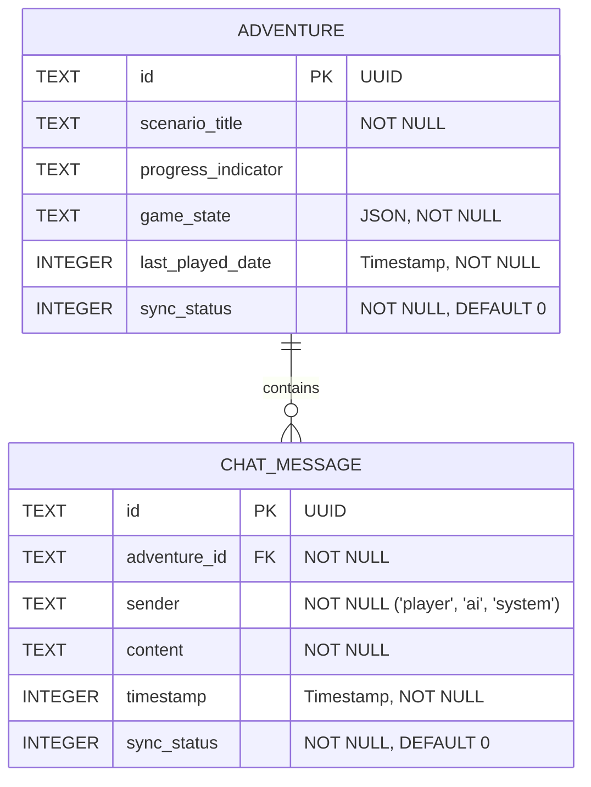

# Mobile Database Overview - Main Screen Feature

Este diagrama mostra as entidades do banco de dados local (SQLite) e seus relacionamentos para a funcionalidade da Tela Principal.

**Entidades:**

*   **ADVENTURE:** Armazena informações sobre cada aventura iniciada pelo jogador.
    *   `game_state`: Contém o estado atual do jogo serializado em JSON.
    *   `last_played_date`: Usado para ordenar as aventuras na tela principal.
*   **CHAT_MESSAGE:** Armazena cada mensagem trocada durante uma aventura.
    *   `adventure_id`: Chave estrangeira que liga a mensagem à sua aventura correspondente (`ADVENTURE.id`).
    *   `timestamp`: Usado para ordenar as mensagens dentro de uma conversa.

**Relacionamento:**

*   **ADVENTURE `||--o{` CHAT_MESSAGE : "contains"**: Indica um relacionamento de **um-para-muitos**. Uma (`||`) `ADVENTURE` pode conter (`contains`) zero ou muitas (`o{`) `CHAT_MESSAGE`s. A ligação é feita através da chave estrangeira `CHAT_MESSAGE.adventure_id` que referencia `ADVENTURE.id`. A notação `o{` é a sintaxe correta do Mermaid para "zero ou muitos".

**Notas:**

*   Os cenários (`Scenario`) não estão no banco de dados, pois são carregados de arquivos JSON locais conforme RNF-007.
*   `sync_status` é incluído para otimizações futuras de sincronização.