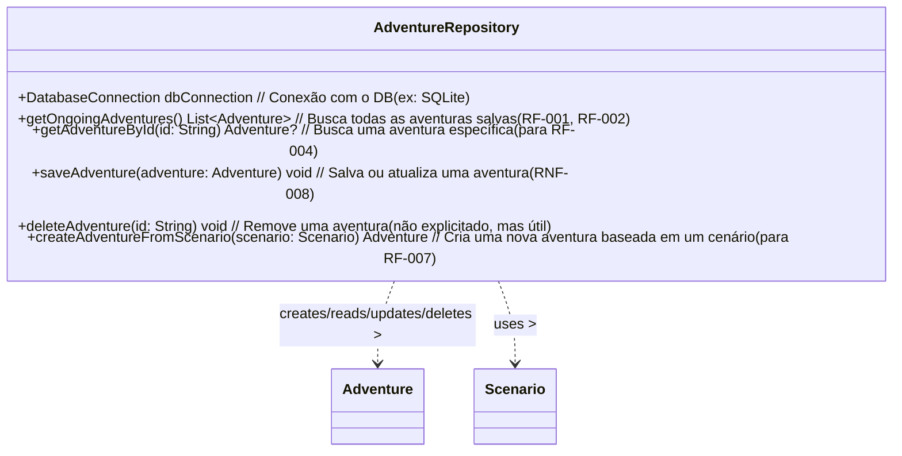

# Classe: AdventureRepository (Data Access / Model Support)

Abstrai as operações de banco de dados (ex: SQLite) para salvar, carregar e listar as aventuras em andamento do jogador (RNF-008).

**Diagrama UML (Mermaid):**

**Atributos:**

*   `dbConnection`: Referência à conexão com o banco de dados local.

**Métodos:**

*   `getOngoingAdventures()`: Retorna a lista de `Adventure` em andamento do DB (RF-001, RF-002).
*   `getAdventureById(id)`: Busca uma `Adventure` específica pelo ID (RF-004).
*   `saveAdventure(adventure)`: Insere ou atualiza uma `Adventure` no DB (RNF-008).
*   `deleteAdventure(id)`: (Opcional) Remove uma `Adventure` do DB.
*   `createAdventureFromScenario(scenario)`: Cria um novo objeto `Adventure` a partir de um `Scenario` (RF-007), pronto para ser salvo.

**Relacionamentos:**

*   Gerencia o ciclo de vida (CRUD) das instâncias de `Adventure` no armazenamento persistente.
*   Utiliza informações de `Scenario` para criar novas `Adventure`.
*   Usado pelo `MainScreenController` para obter e manipular dados de aventuras.