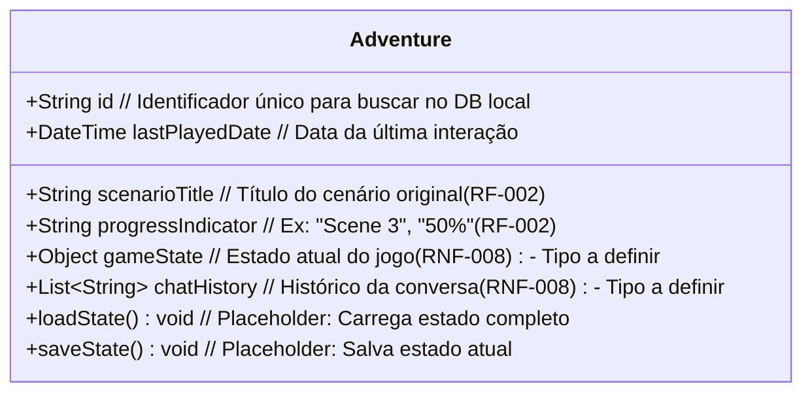

# Classe: Adventure (Model)

Representa uma aventura em andamento que o jogador já iniciou.

**Diagrama UML (Mermaid):**

**Atributos:**

*   `id`: Identificador único para recuperar a aventura salva (RNF-008).
*   `scenarioTitle`: Título do cenário associado (RF-002).
*   `progressIndicator`: Uma string que descreve o progresso atual (RF-002).
*   `gameState`: Objeto/estrutura contendo o estado atual do jogo (RNF-008).
*   `chatHistory`: Lista/estrutura contendo o histórico da conversa (RNF-008).
*   `lastPlayedDate`: Data/hora da última vez que a aventura foi jogada.

**Métodos:**

*   `loadState()`: Placeholder para carregar dados detalhados da aventura.
*   `saveState()`: Placeholder para salvar o estado atual da aventura.

**Relacionamentos:**

*   Criada/Lida/Atualizada/Deletada por `AdventureRepository`.
*   Baseada em um `Scenario` (usa `scenarioTitle` na Main Screen).
*   Gerenciada pelo `MainScreenController`.
*   Exibida pela `MainScreenView`.