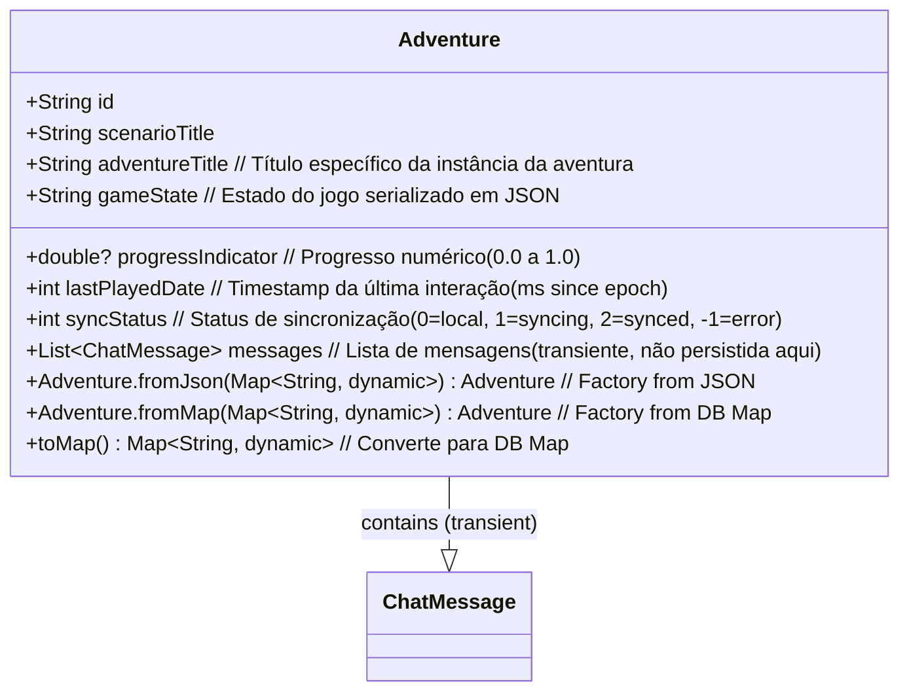

# Classe: Adventure (Model)

Representa uma aventura em andamento que o jogador já iniciou.

**Diagrama UML (Mermaid):**

**Atributos:**

*   `id`: Identificador único (UUID) da aventura.
*   `scenarioTitle`: Título do cenário base no qual a aventura foi iniciada.
*   `adventureTitle`: Título específico definido para esta instância da aventura.
*   `progressIndicator`: Valor numérico opcional (0.0 a 1.0) indicando o progresso.
*   `gameState`: String JSON contendo o estado completo serializado do jogo.
*   `lastPlayedDate`: Timestamp (inteiro, milissegundos desde a época Unix) da última interação.
*   `syncStatus`: Inteiro indicando o status de sincronização (0=local, 1=syncing, 2=synced, -1=error). Padrão 0.
*   `messages`: Lista de objetos `ChatMessage` associados. Este campo é transiente e carregado sob demanda, não sendo persistido diretamente na tabela `Adventure`. Padrão `[]`.

**Métodos:**

*   `Adventure.fromJson()`: Factory para criar uma instância a partir de um mapa JSON.
*   `Adventure.fromMap()`: Factory para criar uma instância a partir de um mapa vindo do SQFlite.
*   `toMap()`: Converte a instância em um mapa adequado para persistência no SQFlite (excluindo campos transientes como `messages`).

**Relacionamentos:**

*   Criada/Lida/Atualizada/Deletada por `AdventureRepository`.
*   Baseada em um `Scenario` (usa `scenarioTitle` na Main Screen).
*   Gerenciada pelo `MainScreenController`.
*   Exibida pela `MainScreenView`.