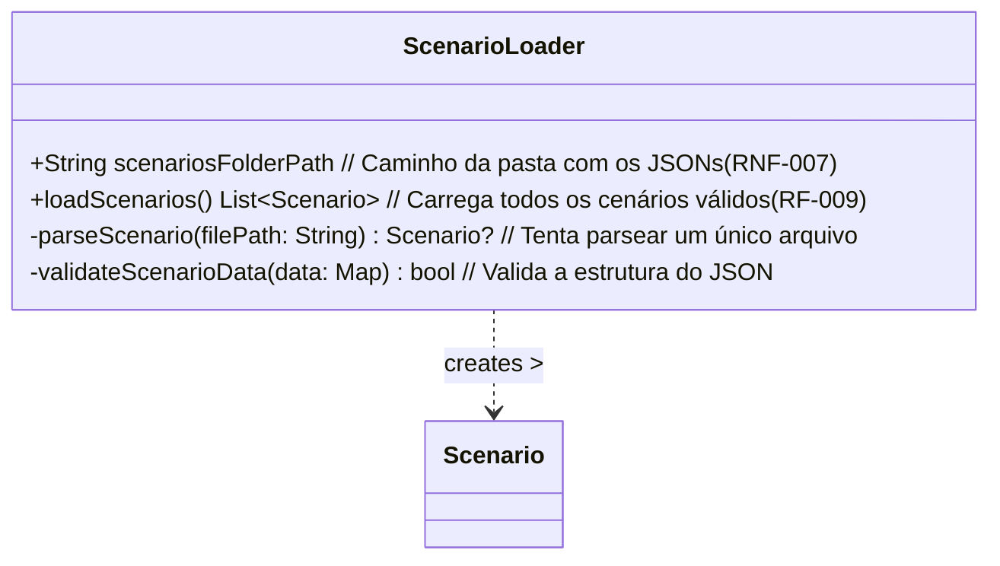

# Classe: ScenarioLoader (Data Access / Model Support)

Responsável por encontrar, ler e parsear os arquivos JSON que definem os cenários disponíveis (RF-009, RNF-007).

**Diagrama UML (Mermaid):**

**Atributos:**

*   `scenariosFolderPath`: Caminho configurável para a pasta contendo os arquivos `.json` dos cenários (RNF-007).

**Métodos:**

*   `loadScenarios()`: Varre a pasta `scenariosFolderPath`, tenta ler/parsear cada JSON. Cria objetos `Scenario` válidos e trata erros (RF-009, RF-008).
*   `parseScenario(filePath)`: (Privado) Lê, parseia e tenta instanciar um `Scenario` de um arquivo.
*   `validateScenarioData(data)`: (Privado) Verifica se os dados do JSON contêm os campos obrigatórios.

**Relacionamentos:**

*   Cria instâncias de `Scenario`.
*   Usado pelo `MainScreenController` para obter a lista de cenários disponíveis.