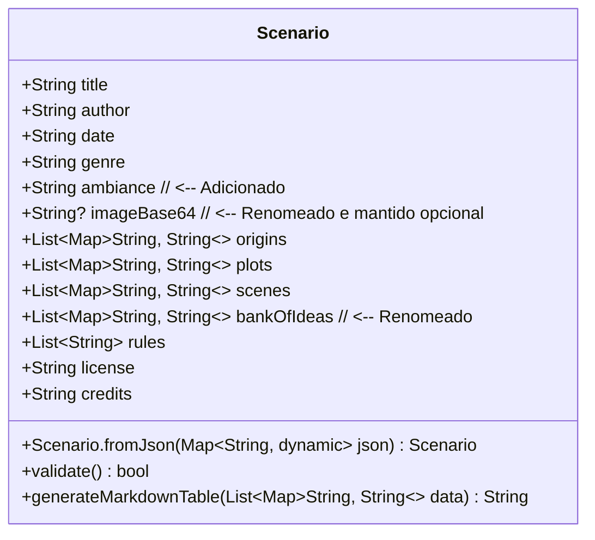

# Diagrama UML da Classe Scenario (IA Master)

Este diagrama representa a estrutura da classe `Scenario` com base na análise dos arquivos JSON de exemplo e na decisão de modelar `origins`, `plots`, `scenes`, e `bank_of_ideas` como `List<Map<String, String>>`.

**Notas:**

*   `imageBase64` é opcional (`String?`) e renomeado para camelCase.
*   `bankOfIdeas` renomeado para camelCase.
*   Adicionado o atributo `ambiance` (String) para refletir o JSON e atender ao RF-006 (usado como descrição).
*   Os atributos `origins`, `plots`, `scenes`, e `bankOfIdeas` continuam como `List<Map<String, String>>` por enquanto.
*   O método `generateMarkdownTable` é um exemplo de funcionalidade para processar as listas de mapas e gerar tabelas Markdown dinamicamente.